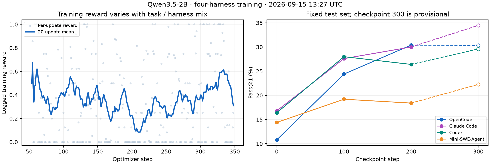

# Multi-harness progress — 2026-09-15T13:27:32.270545+00:00

Trainer **79083** is at **step 348** on hopper-prod. Qwen3.5-2B; E2B; OpenCode, Claude Code, Codex and Mini-SWE-Agent. LR 3e-6, eight generations per task, max staleness four. Saves every 50 steps plus hourly recovery saves; independent eval every 100 steps.

The fixed test set contains 250 tasks: 33 easy, 118 medium and 99 hard. Each complete checkpoint evaluation has 1,000 pass@1 cells. Partial scores remain provisional until coverage, token and harness-version audits pass.

| Harness | Base | Checkpoint 100 | Checkpoint 200 | Checkpoint 300 (partial) |
| --- | ---: | ---: | ---: | ---: |
| OpenCode | 10.8% (27/250) | 24.4% (61/250) | 30.4% (76/250) | 30.3% (74/244) |
| Claude Code | 16.8% (42/250) | 27.6% (69/250) | 30.0% (75/250) | 34.5% (81/235) |
| Codex | 16.4% (41/250) | 28.0% (70/250) | 26.4% (66/250) | 29.6% (74/250) |
| Mini-SWE-Agent | 14.4% (36/250) | 19.2% (48/250) | 18.4% (46/250) | 22.3% (55/247) |
| Overall | 14.6% (146/1000) | 24.8% (248/1000) | 26.3% (263/1000) | 29.1% (284/976) |

| Difficulty, all harnesses | Base | Checkpoint 100 | Checkpoint 200 | Checkpoint 300 (partial) |
| --- | ---: | ---: | ---: | ---: |
| easy | 40.2% (53/132) | 53.0% (70/132) | 58.3% (77/132) | 64.6% (84/130) |
| medium | 14.4% (68/472) | 30.5% (144/472) | 30.1% (142/472) | 33.6% (155/461) |
| hard | 6.3% (25/396) | 8.6% (34/396) | 11.1% (44/396) | 11.7% (45/385) |

| Harness | Difficulty | Base | Checkpoint 100 | Checkpoint 200 | Checkpoint 300 (partial) |
| --- | --- | ---: | ---: | ---: | ---: |
| OpenCode | easy | 33.3% (11/33) | 51.5% (17/33) | 51.5% (17/33) | 60.6% (20/33) |
| OpenCode | medium | 8.5% (10/118) | 31.4% (37/118) | 34.7% (41/118) | 33.9% (39/115) |
| OpenCode | hard | 6.1% (6/99) | 7.1% (7/99) | 18.2% (18/99) | 15.6% (15/96) |
| Claude Code | easy | 42.4% (14/33) | 60.6% (20/33) | 63.6% (21/33) | 67.7% (21/31) |
| Claude Code | medium | 18.6% (22/118) | 32.2% (38/118) | 33.1% (39/118) | 41.1% (46/112) |
| Claude Code | hard | 6.1% (6/99) | 11.1% (11/99) | 15.2% (15/99) | 15.2% (14/92) |
| Codex | easy | 42.4% (14/33) | 57.6% (19/33) | 63.6% (21/33) | 69.7% (23/33) |
| Codex | medium | 16.9% (20/118) | 35.6% (42/118) | 29.7% (35/118) | 33.1% (39/118) |
| Codex | hard | 7.1% (7/99) | 9.1% (9/99) | 10.1% (10/99) | 12.1% (12/99) |
| Mini-SWE-Agent | easy | 42.4% (14/33) | 42.4% (14/33) | 54.5% (18/33) | 60.6% (20/33) |
| Mini-SWE-Agent | medium | 13.6% (16/118) | 22.9% (27/118) | 22.9% (27/118) | 26.7% (31/116) |
| Mini-SWE-Agent | hard | 6.1% (6/99) | 7.1% (7/99) | 1.0% (1/99) | 4.1% (4/98) |

On the same cells completed by the latest checkpoint: base: 14.8% (144/976); 100: 25.1% (245/976); 200: 26.4% (258/976); 300: 29.1% (284/976).

Infrastructure attempts without a graded result are retained separately and may be retried. A scored zero is never replaced by a retry. Ungraded attempts by checkpoint: {"100": 49, "200": 81, "300": 29}.

## Training signal and reliability

| Steps | Mean logged reward | Nonzero-gradient updates | Mean step time |
| --- | ---: | ---: | ---: |
| 54–100 | 0.378 | 34/47 | 99.8s |
| 101–150 | 0.411 | 31/50 | 99.0s |
| 151–200 | 0.257 | 28/50 | 90.5s |
| 201–250 | 0.234 | 28/50 | 92.1s |
| 251–280 | 0.370 | 24/30 | 90.4s |
| 281–310 | 0.416 | 19/30 | 79.9s |
| 311–348 | 0.428 | 16/38 | 98.4s |

Reward is the unweighted mean of logged optimizer-update reward, not fixed-task pass@1. The changing task/harness mix affects it. Zero within-group reward variance produces no relative-advantage learning signal; high mean reward alone does not guarantee useful updates.

The current continuation has 89/152 nonzero-gradient updates and 0 nonfinite updates. The latest 20 have 9 nonzero gradients and 11 zero-variance updates. Observed staleness is at most 4.0; 12 whole rollouts (75 rows) were rejected by the staleness policy; 0 oversized rows were dropped.

Latest saved checkpoints: 200, 238, 250, 294, 300, 337. The audited captures pass TiTO on 829/829 completed rollouts, retaining 2,006,380/2,006,380 eligible tokens. Audit timestamp: 2026-09-15T13:27:16.386308+00:00. This is capture/sequence-assembly evidence, not a claim that every captured rollout reached the optimizer.

Continuation coverage: 102/1,000 unique training tasks. The continuation started with a saved schedule cursor, so this count excludes the parent run’s earlier coverage; optimizer steps are not unique tasks.

Monitor alerts: [] at 2026-09-15T13:27:18.505481+00:00. The latest nonzero-gradient update is step 348; monitor alerts may precede newer updates. Offline logging healthy: True; online Trackio healthy: True at 2026-09-15T13:26:48.432030+00:00.

Source paths, exact counts, resume-chain provenance and timestamps are preserved in the companion JSON snapshot.

