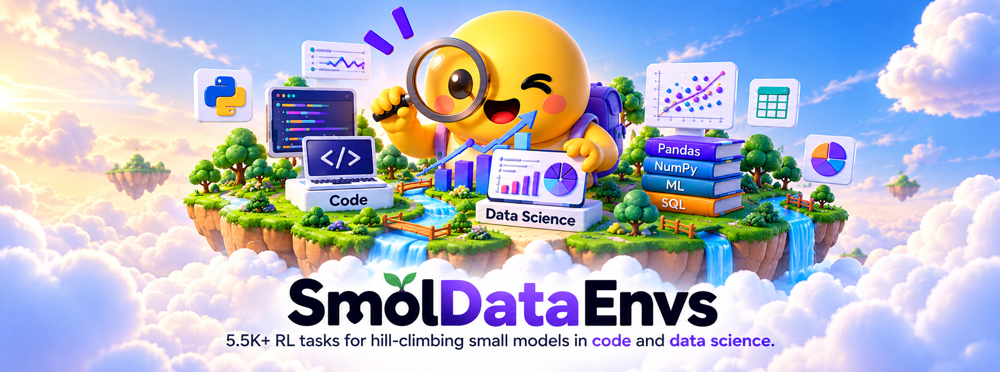
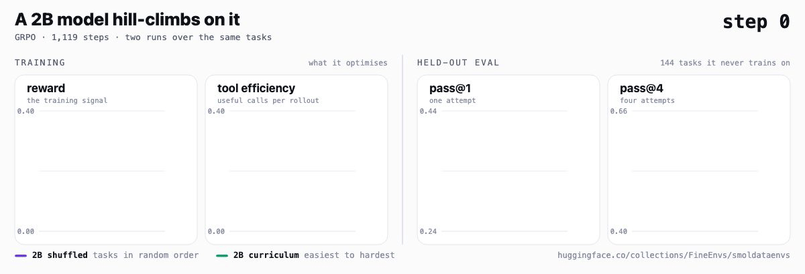

<div align="center">



# SmolDataEnvs

[](https://huggingface.co/collections/FineEnvs/smoldataenvs)
[](https://huggingface.co/spaces/HuggingFaceH4/harbor-visualiser?dataset=FineEnvs/SmolDataEnvs-harbor-train)

</div>

> **5.5K+ RL tasks for hill-climbing small models in code and data science.**

<div align="center">



<sub>A 2B model on these tasks. Left: what it optimises. Right: 144 held-out tasks it never trains on.<br>
Two runs over the same 5,000 tasks — <b>shuffled</b> against a <b>curriculum</b> ordered easiest to hardest.</sub>

</div>

## What this is

A small model that can write code is not the same thing as a small model that can *use* code to
answer a question about data. The second one has to open a file it has never seen, work out what is
in it, decide what to compute, run something, read the result, and commit to an answer. That is a
long-horizon task with a short, checkable answer at the end — which is exactly the shape RL wants.

SmolDataEnvs is 5,394 of those tasks. Each one is a real Kaggle dataset, a question a human actually
asked about it in a notebook, and the answer that human computed. The agent gets a sandbox with the
files in it and has to produce the answer.

**Verified, not judged.** Grading is an exact comparison against a known answer, through a ladder of
checks: exact match → numeric with per-task tolerances → list and percent normalisation → symbolic
equivalence. No LLM sits in the reward path. The reward cannot drift because there is nothing in it
to drift.

Every task was built the hard way, too: strong agent models had to solve it in a live sandbox and
reproduce the gold answer before it was allowed in. Anything ambiguous or un-checkable was dropped.
So a zero from a task is a statement about your model, not about the task.

## What's in it

| Split | Tasks | Easy | Medium | Hard |
|---|---|---|---|---|
| train | 5,000 | 1,433 | 2,845 | 722 |
| test | 250 | 33 | 118 | 99 |
| eval | 144 | 16 | 74 | 54 |

Drawn from 471 Kaggle datasets. Answer types run numeric (2,906), short label (1,409), list (367),
free-form (152), yes/no (127) and csv-list (39) — the match mode is per task, and so are the numeric
tolerances.

**The held-out splits are deliberately harder than train.** Train is 29% easy and 14% hard; test and
eval are 11–13% easy and 38–40% hard. Worth knowing before reading any eval number from this dataset,
including ours.

## Five repos, three ways in

| Repo | Use it when |
|---|---|
| [`SmolDataEnvs`](https://huggingface.co/datasets/FineEnvs/SmolDataEnvs) | you want the tasks as rows: question, answer, match mode, data pointer. Plus `grader.py` |
| [`SmolDataEnvs-sft`](https://huggingface.co/datasets/FineEnvs/SmolDataEnvs-sft) | you want 4,677 verified agent trajectories to fine-tune on |
| [`SmolDataEnvs-harbor-train`](https://huggingface.co/datasets/FineEnvs/SmolDataEnvs-harbor-train) | you want to actually run RL: 5,000 sandboxed environments |
| [`SmolDataEnvs-harbor-test`](https://huggingface.co/datasets/FineEnvs/SmolDataEnvs-harbor-test) | you want a number to quote: 250 held-out tasks |
| [`SmolDataEnvs-harbor-eval`](https://huggingface.co/datasets/FineEnvs/SmolDataEnvs-harbor-eval) | you want to watch a run: 144 tasks, cheap enough to run often |

## Start here

[`notebooks/train_smoldataenvs.ipynb`](./notebooks/train_smoldataenvs.ipynb) goes from one task to a
trained model in one sitting: look at a task, pull its data, grade an answer the way the dataset
grades it, then fine-tune a small model on the verified trajectories. It runs end to end on a free
Colab T4 with the 360M default.

## Train it on a GPU you do not own

The notebook's training cell also exists as a single self-contained script, so it can be handed
straight to Hugging Face Jobs:

```bash
# quick: 360M, finishes in minutes, proves the path
./scripts/run_on_hf_jobs.sh your-username/smoldataenvs-sft-360m

# real: 3B on an A10G
MODEL=HuggingFaceTB/SmolLM3-3B FLAVOR=a10g-large TIMEOUT=3h \
  ./scripts/run_on_hf_jobs.sh your-username/smoldataenvs-sft-3b
```

The Jobs container is deleted when the job ends, which is why the script pushes to the Hub rather
than writing to disk, and why the launcher insists on a model id.

Locally, the same script with no GPU:

```bash
MAX_SAMPLES=32 uv run scripts/train_sft.py
```

## Then the RL

SFT on correct trajectories is the warm start. The reason the tasks ship as Harbor environments is
so a policy can be trained against the verifier itself:

```bash
openenv harbor serve \
  --dataset FineEnvs/SmolDataEnvs-harbor-train,FineEnvs/SmolDataEnvs-harbor-eval \
  --llm-url http://127.0.0.1:8000/v1 --model your-model \
  --port 8000 --capture-port 8100
```

Each `--dataset` arrives as its own split, so one server covers training and validation. What comes
back per rollout is the reward from the task's own verifier plus the exact token ids the model
generated — which is what makes it trainable rather than merely observable.

## Layout

```
04-smoldataenvs/
  notebooks/train_smoldataenvs.ipynb   one task → grading → a fine-tuned model
  scripts/train_sft.py                 the same run, single file, PEP 723 deps
  scripts/run_on_hf_jobs.sh            hand it to a Hugging Face Jobs GPU
```

## Provenance

Built from the [jupyter-agent dataset](https://huggingface.co/datasets/jupyter-agent/jupyter-agent-dataset)
— real data-science notebooks over Kaggle datasets — then verified end to end in a sandbox. The
training and evaluation work that used these tasks is written up in
[The ultimate guide to multi-harness RL](https://huggingface.co/spaces/AdithyaSK/multi-harness-rl).
