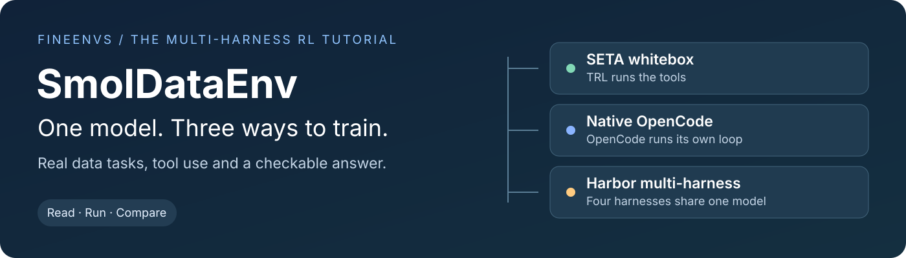
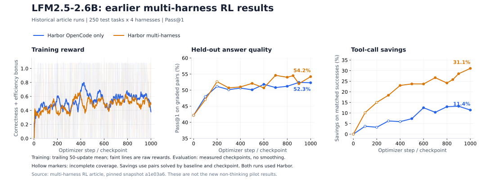

<div align="center">

<a href="https://huggingface.co/spaces/FineEnvs/multi-harness-rl"></a>

# SmolDataEnvs: multi-harness RL

[](https://huggingface.co/spaces/FineEnvs/multi-harness-rl)
[](https://huggingface.co/collections/FineEnvs/smoldataenvs-multi-harness-rl-6abdfaaa8d74dacd481d5212)
[](https://huggingface.co/spaces/FineEnvs/smoldataenv-multi-harness-whitebox)

</div>

> Train a small model to solve real data tasks, then see how it behaves in different agent harnesses.

This is the companion code for **[the multi-harness RL article](https://huggingface.co/spaces/FineEnvs/multi-harness-rl)**. The article walks through the experiments and their results. Here you can read the training code, try the environments and run your own comparison with LFM2.5-2.6B or Qwen3.5-2B.

The tasks come from [04: SmolDataEnvs](../04-smoldataenvs/). Each gives an agent a question, data files and a checkable answer. We keep the training tasks and reward shared while changing who runs the tool loop: TRL, native OpenCode or Harbor.

## Start here

| You want to… | Open |
|---|---|
| Understand the experiment and results | [Read the article](https://huggingface.co/spaces/FineEnvs/multi-harness-rl) |
| Try a data task in your browser | [SETA playground](https://huggingface.co/spaces/FineEnvs/smoldataenv-multi-harness-whitebox) |
| Train on HF Jobs or your own GPUs | [Step-by-step setup](REPRODUCE.md) |
| Evaluate a base model or checkpoint | [Evaluation guide](eval/README.md) |
| Find the Spaces, datasets and trained models | [Experiment collection](https://huggingface.co/collections/FineEnvs/smoldataenvs-multi-harness-rl-6abdfaaa8d74dacd481d5212) |

## A look at the article's results

[](https://huggingface.co/spaces/FineEnvs/multi-harness-rl)

<sub>Historical LFM runs from the article. Training reward uses a trailing 50-update mean; evaluation points are unsmoothed. Hollow markers indicate incomplete evaluation coverage. Tool savings compare tasks solved by both baseline and checkpoint.</sub>

Both policies in this figure used Harbor, including the OpenCode-only policy. This tutorial's native OpenCode mode is a separate interface. See [results and source data](RESULTS.md#historical-article-curves) for the numbers behind the figure and [validation](VALIDATION.md) for checks of the current scripts. The first panel shows training reward.

## Three scripts, three tool loops

Each script follows the same order: settings → tokenizer → environment → reward → TRL config → training. Read it from top to bottom, then edit its TRL config to try your own learning rate or batch size.

| Script | Who runs the tool loop? | Trainer |
|---|---|---|
| [train/whitebox.py](train/whitebox.py) | TRL calls Python bash/SETA tools | `GRPOTrainer` |
| [train/opencode.py](train/opencode.py) | Native OpenCode runs inside a sandbox (deprecated) | `AsyncGRPOTrainer` |
| [train/multi_harness.py](train/multi_harness.py) | Harbor runs OpenCode, Claude Code, Codex or Mini-SWE-Agent | `AsyncGRPOTrainer` |

Read whitebox first if you are new to tool-using RL. Its [environment](envs/whitebox/smoldataenv_whitebox/environment.py) shows exactly which tools the model can call and how an answer is graded. Then read the Harbor script to see what changes when an existing agent owns the conversation. The multi-harness script assigns one harness to each task; its eight rollouts all use that assignment.

Native `opencode_env` is deprecated since OpenEnv 0.7.0 and remains here for the earlier comparison. For new runs, use Harbor. Set `HARNESSES = ("opencode",)` in `train/multi_harness.py` for OpenCode-only training, as in the article's LFM run.

The installer uses **TRL main and OpenEnv main**, including the merged typed training-trace integration. `check_setup.py` verifies the required APIs before training. Each run records the resolved commits; see [VALIDATION.md](VALIDATION.md) for the tested versions and remaining GPU checks.

## Folder layout

```text
train/                  Three readable TRL training scripts
  whitebox.py
  opencode.py
  multi_harness.py
eval/evaluate.py        Fixed pass@1 evaluation and tool/token metrics
envs/                   Environment implementations and deployment
  whitebox/             Standalone SETA Space and Python package
  opencode/             Standalone native OpenCode Space and package
  harbor/               Standalone Harbor Space with its rollout UI
jobs/                   HF Jobs, Slurm and train/reload smoke commands
data/                   Fixed task identities
prepare.py              Download and check the task files
```

## What is being trained?

The model receives a question and can inspect data in a Daytona sandbox. Its answer is compared with a held-out answer using the task's deterministic grader. A correct answer earns a small extra reward when it uses fewer tools:

```python
bonus = 0.1 * 15 / (15 + tool_calls) if tool_calls > 0 else 0
reward = correctness * (1 + bonus)
```

A correct answer with 15 tool calls earns `1.05`; a wrong answer earns `0`. Missing tool-count evidence gets no bonus. A failed environment without a grade is excluded, not scored as wrong. The code counts native tool actions, not model requests or training rows.

Whitebox gives TRL the tools and lets it generate each turn. Blackbox gives TRL an OpenEnv session. OpenEnv returns the actual engine token IDs, behavior logprobs and loss masks through `fetch_training_trace()`. TRL trains on the eligible model tokens. Prompts and tool outputs are context.

```python
# Whitebox: TRL owns generation and tool execution.
trainer = GRPOTrainer(
    model=model,
    args=config,
    train_dataset=dataset,
    reward_funcs=[],
    environment_factory=BashEnvironment,
)

# Blackbox: the agent owns generation; OpenEnv captures its tokens.
worker = HarnessRolloutWorker(
    harness_session_factory=factory,
    harness_adapter=None,
    rollout_reward_fn=reward,
    # See either blackbox script for the model and sampling arguments.
)
trainer = AsyncGRPOTrainer(
    model=model,
    args=config,
    train_dataset=dataset,
    rollout_worker=worker,
)
```

These are the boundaries to compare. The complete calls, including every training parameter, are in the scripts above.

## Run a small experiment

Use Python 3.12 and two H100 or H200 GPUs: one for vLLM, one for training. HF Jobs can supply them; you do not need a GPU on your laptop. OpenEnv runs inside the job. Daytona supplies the task sandboxes. Each [environment folder](envs/README.md) is also a standalone CPU Space: its local Dockerfile and application files are uploaded unchanged.

Follow [REPRODUCE.md](REPRODUCE.md) for installation, a two-step smoke, a 100-step comparison, and checkpoint evaluation. From a prepared local environment:

```bash
# Two updates, save both checkpoints, then reload checkpoint 2 for evaluation.
python jobs/smoke.py --mode multi_harness --output runs/harbor-smoke
```

Use `--mode opencode` for native OpenCode, or `--mode whitebox` for bash/SETA. Evaluation uses the same driver for all three training modes:

| Training mode | Evaluation interface | Full pass@1 evaluation |
|---|---|---|
| SETA whitebox | Its own bash/SETA tools | 250 attempts |
| Native OpenCode | OpenCode, Claude Code, Codex and Mini-SWE-Agent through Harbor | 1,000 attempts |
| Harbor multi-harness | The same four Harbor harnesses | 1,000 attempts |

The two blackbox policies share an evaluation protocol so you can compare transfer across harnesses. SETA is reported separately. The [evaluation guide](eval/README.md) explains local or Space endpoints, checkpoint loading, coverage and retrying failed pairs.

## Shared settings

| Setting | Value |
|---|---|
| Models | LFM2.5-2.6B or Qwen3.5-2B, non-thinking |
| Training tasks | 1,000 fixed tasks: 400 medium, 600 hard |
| Test tasks | 250 fixed tasks: 33 easy, 118 medium, 99 hard |
| Learning rate | `3e-6`, constant, no warmup |
| Sampling | Temperature `0.8`, full vocabulary |
| Rollouts per task group | 8 |
| Async limits | 32 inflight, maximum staleness 4 |
| Async batching | Batch 4, accumulation 4, packed row budget 40,960 tokens |
| Whitebox batching | Batch 1, accumulation 16 |
| Training length | Up to 1,000 optimizer updates |
| Save / evaluate | Save every 50; evaluate checkpoints 100, 200, … separately |
| Evaluation | Pass@1, default concurrency 35, TP1/DP2 |

A step is an optimizer update, not a task. Async sampling and packing can use a variable number of prompts per step. This tutorial uses the upstream sampler and does not reproduce the archive's custom finite curriculum, exact committed-group resume, or whole-rollout weighting. Whitebox consumes 16 rollouts, or two groups of eight, per update. Blackbox histories can fork into multiple rows; long rows beyond the packing budget are dropped by upstream TRL. Inspect its drop and staleness metrics.

Both models use a 131,072-token serving context and up to 4,096 tokens per model call. Whitebox and Harbor cap the agent at 17 model turns. The public native OpenCode API has a 600-second timeout and per-call token cap, but no equivalent strict turn limit. These limits are not interchangeable. LFM's packed convolution boundary handling is explicit in each async script and checked on the GPU before training.

## Where to look next

- [envs/](envs/README.md): actual environments, OpenEnv servers and clients, Docker image and Space deployment.
- [eval/evaluate.py](eval/evaluate.py): individual pass@1 results, coverage, correctness, tool calls and token usage. Failed pairs remain visible and can be retried without rerunning graded pairs.
- [jobs/](jobs/): installation, service startup, HF submission and a Slurm template. No hidden training configuration.
- [prepare.py](prepare.py) and [data/](data/): fixed task selection and checked dataset revisions.
- [RESULTS.md](RESULTS.md): earlier experiment results and artifact locations.

Training keeps local Trackio data and checkpoints. Add `--space-id your-org/your-trackio-space` to also publish charts. It does not automatically write to the historical dashboard.

## Earlier experiments

The full experimental implementation remains on the [archived branch](https://github.com/adithya-s-k/FineEnvs/tree/archive/data-agent-experiments-20260930/04-data-agent). Earlier recipe code is also recoverable from this branch's git history.
