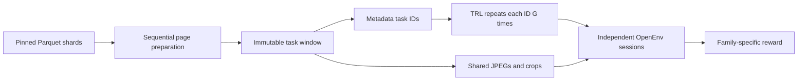

# 05 · Multilingual OCR

**Stream document data once, then replay the same task across RL rollouts.** This experiment
uses [NayanaOCR_Corpus_2025](https://huggingface.co/datasets/Cognitive-Lab/NayanaOCR_Corpus_2025)
to demonstrate data handling in OpenEnv: bounded preparation, document-level partitions,
metadata-only discovery, shared images, and reproducible task assignment.

The first milestone is implemented and tested locally. It includes one OpenEnv environment
with two task families, a Gradio playground, a notebook, a single-GPU TRL recipe, and HF Jobs
and Space deployment scripts. **GPU training and a public Space have not been run for this
experiment yet.** There are no multilingual model quality claims.

| Task | Observation | Answer | Reward |
|---|---|---|---|
| `section_ocr` | Lossless crop of one annotated region | Transcription in the source language | `0.8 × max(0, 1−CER) + 0.2 × exact_match` |
| `mcq_vqa` | Original page JPEG, question, options | One uppercase option letter | Exact letter match |

One shared data layer serves both families. Section OCR uses `english_text` for English and
`translated_text` for other languages. Missing or ambiguous annotations are counted and
excluded. References stay server-side, including after grading.

<!-- BEGIN:matrix -->
| Env | Tools | Backend | `openenv` |
|---|---|---|---|
| **nayana_ocr** | — | `http` | ✅ |
<!-- END:matrix -->

## Run it

From this project directory:

```bash
# Offline synthetic fixtures: HTTP, media, concurrent WebSockets, and TRL adapter.
uv run --frozen --project envs/nayana_ocr nayana-smoke

# Eight real pages: two each from English, Kannada, Hindi, Arabic.
uv run --frozen --project envs/nayana_ocr nayana-prepare \
  --output data/snapshots/real-smoke --pages-per-language 2
uv run --frozen --project envs/nayana_ocr nayana-smoke \
  --snapshot data/snapshots/real-smoke

# Serve that exact window. Open http://localhost:8000/web for the playground.
NAYANA_SNAPSHOT="$PWD/data/snapshots/real-smoke" \
  uv run --frozen --project envs/nayana_ocr nayana-server
```

Preparation reads pinned Parquet shards with `streaming=True`, `Image(decode=False)`, and
one-row batches. It stores only the selected window: SQLite task metadata and image files
named by SHA-256. Task discovery reads SQLite; it does not open images or advance a stream.
Every worker and session uses the same finalized window.

See the [notebook](notebooks/05_multilingual_ocr.ipynb) for the complete CPU walkthrough and
[REPRODUCE.md](REPRODUCE.md) for training, HF Jobs, Docker, deployment, limits, and checkpoint behavior.

## Why data handling matters here

The pinned corpus contains **1,006,170 page rows across 22 languages** and about **814 GB** of
repository files. It provides parallel synthetic renderings of 45,735 pages per language,
with region text, layout boxes, and VQA. It has only an upstream `train` split. The
[source manifest](data/source-manifest.json) records the exact revision and per-language
file counts and sizes, based on Hub metadata.



- **Splits follow documents.** A seeded SHA-256 partition assigns each document to train,
  validation, or test with 80/10/10 buckets. All pages, languages, crops, and questions from
  that document follow it. Language row orders differ; row offsets are never used to join them.
- **Sampling happens before reset.** TRL repeats a task ID for each completion in its group.
  Reset selects that ID directly. No rollout advances an independent dataset cursor.
- **The active window stays available.** Its images and references remain on disk throughout
  the run. Client image caching is bounded by bytes and verifies content hashes. This first
  milestone uses an immutable window rather than implementing distributed leases or eviction.
- **Preparation can resume.** Each page's tasks and the unshuffled Datasets iterator state
  commit together. Rerun the same command after interruption. Version and configuration
  mismatches fail explicitly. A finished manifest marks the window ready for serving.
- **Media are separate from JSON.** VQA preserves embedded JPEG bytes; OCR crops are PNG.
  The adapter fetches binary media once per cache entry and supplies PIL images to TRL.
  Nayana's `__url__` records source provenance and is not an image download endpoint.

OpenEnv supplies the Task API and session protocol. The preparation, catalog, task derivation,
and image cache here are application code, not new capabilities claimed for OpenEnv itself.
The design follows the [Datasets streaming guidance](https://huggingface.co/docs/datasets/stream)
and [TRL environment interface](https://huggingface.co/docs/trl/grpo_trainer#environments).

## Verification and next milestones

The [recorded real-data check](results/smoke-real-data.json) covers section OCR and MCQ VQA
for English, Kannada, Hindi, and Arabic. Eight pages yielded **37 tasks and 5,945,947 media
bytes**. Three MCQs had answers that could not be mapped uniquely to an option and were
excluded. All eight pages belong to the train partition, so this tiny window is suitable
for transport checks and cannot support a held-out training comparison.

Tests exercise Unicode preservation, crop bounds, hidden references, independent episodes,
resume, byte limits, balanced task selection, and actual TRL map/iterable group repetition.
See [results/README.md](results/README.md) for what was measured and what remains untested.

Next milestones are a document-diverse training/evaluation window, a GPU optimizer smoke,
and measured training runs with per-language and per-task results. After that, extend the
same environment with layout-region detection. Page OCR needs an audited reading-order
policy; descriptive VQA needs validated answer scoring. They are not enabled in this version.
These layout annotations do not establish generic object detection or word-level boxes.

## Files

```text
envs/nayana_ocr/     installable OpenEnv package, data layer, Gradio, Docker, tests, lockfile
data/               pinned source manifest; generated windows are ignored by Git
train/              shared GRPO runner, HF Jobs launcher, explicit Space publisher
notebooks/          local data and environment walkthrough, optional training
results/            small verification reports; local training outputs are ignored
REPRODUCE.md        commands, configurations, scoring and replay details
```

Code is Apache-2.0. Nayana data and derived crops retain the dataset's **CC BY-NC 4.0**
license and CognitiveLab attribution. See [data/README.md](data/README.md).
