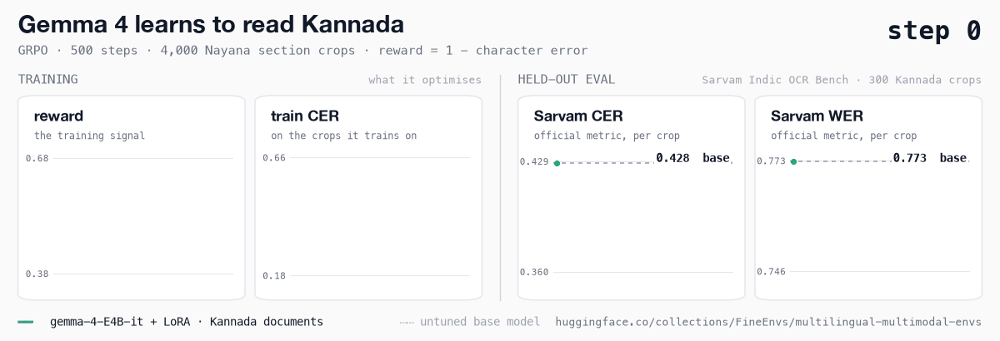
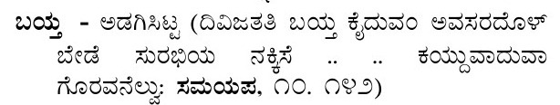
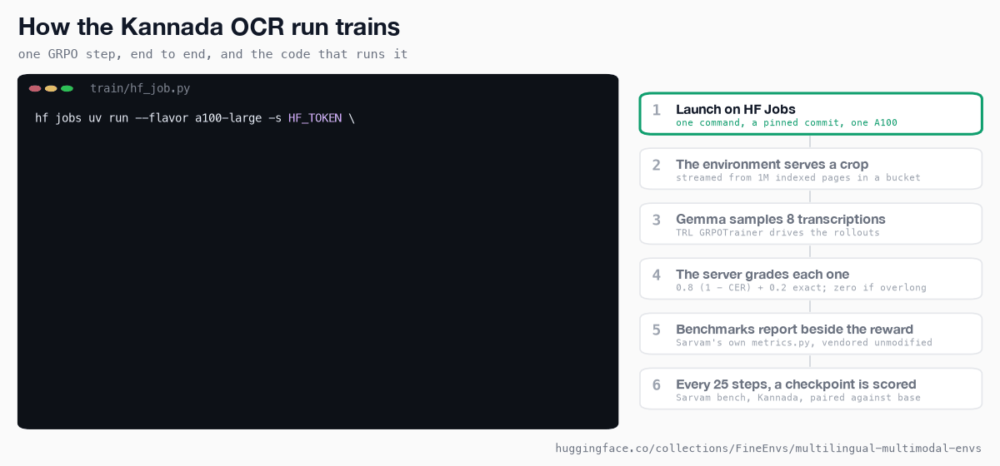

<div align="center">


<h1>Multilingual OCR</h1>

<h3>A million document pages in 22 languages, behind one OpenEnv server</h3>

<p>The whole Nayana corpus as an RL environment, Sarvam Indic OCR Bench served beside it, and a Gemma 4 trained to read Kannada.</p>

<a href="https://huggingface.co/spaces/FineEnvs/nayana-ocr-env"></a>
<a href="https://huggingface.co/FineEnvs/gemma-4-E4B-it-kannada-ocr-grpo"></a>
<a href="https://huggingface.co/collections/FineEnvs/multilingual-multimodal-envs-6ac0c27c137f93e0799603e4"></a>
<a href="https://github.com/huggingface/OpenEnv"></a>

</div>

---

## The result

Gemma 4 E4B, trained with GRPO on 4,000 Kannada text crops, makes **16% fewer character errors** on
the Kannada part of [Sarvam Indic OCR Bench](https://huggingface.co/datasets/sarvamai/indic-ocr-bench),
a benchmark it never trained on. 500 steps, one A100, 10.5 hours.



| Sarvam Indic OCR Bench, Kannada, 300 crops | base | trained | change, 95% CI |
|---|---:|---:|---:|
| **character error rate** | 0.4277 | **0.3601** | −0.068 (−0.083, −0.052) |
| word error rate | 0.773 | 0.748 | −0.025 (−0.037, −0.014) |
| word accuracy | 22.7% | 25.2% | |
| outputs that loop or collapse | 16 | 10 | |
| outputs that slip into another script | 12.3% | 5.0% | |

The error rates are the benchmark's own, from Sarvam's `metrics.py`, run unmodified, so they can be
compared with Sarvam's published numbers. Each change is paired crop by crop against the untuned
model, on the same vLLM engine. 223 crops get better and 62 get worse.

The gain is real but modest, and it stops early: the curve is flat from step 300. [What it
learned](#what-it-learned) says why.

## What this is

You get a crop from a scanned book: three lines of Kannada verse, a caption, a column of a
dictionary. You type out the text. A server compares it with what a human transcribed and pays you
for every character you got right.

That is one of five tasks this environment serves from
[CognitiveLab's Nayana corpus](https://huggingface.co/datasets/Cognitive-Lab/NayanaOCR_Corpus_2025):
1,006,170 pages in 22 languages, indexed into 11 million tasks. The other four read a whole page,
draw the layout boxes, or answer a question about the page, either multiple choice or in free text.
The pages stay in a [bucket](https://huggingface.co/buckets/FineEnvs/NayanaOCR_Corpus_2025_bucket)
and are fetched one at a time, so you can train on 813 GB of documents without downloading them.

Sarvam Indic OCR Bench is served next to the corpus as evaluation-only splits: 6,908 human-checked
text blocks in 23 languages, eleven of which are not in Nayana. A benchmark crop is an ordinary
section-OCR task with the same reward, so the two read on one scale. Sarvam's own error rates are
reported beside the reward.

## What it learned

It learned to stay in the script.

The untuned model reads Kannada reasonably well, but one crop in eight comes back with letters
from another Indic script in the middle. Training cuts that to one in twenty, and outputs that loop or
fall apart drop from 16 to 10. A crop at the 25th percentile of improvement:



| | transcription | Sarvam CER |
|---|---|---:|
| reference | ಬಯ್ತ - ಅಡಗಿಸಿಟ್ಟ (ದಿವಿಜತತಿ ಬಯ್ತು ಕೈದುವಂ ಅವಸರದೊಳ್ / ಬೇಡೆ ಸುರಭಿಯ ನಕ್ಕಿಸೆ .. .. ಕಯ್ದುವಾದುವಾ / ಗೊರವನೆಲ್ವು: ಸಮಯಪ, ೧೦. ೧೪೨) | |
| before | ಬತ್ತು - ಅಡಗಿಸಿಟ್ಟಿ (ದವಿಚತೇ **वायु** ಕೃಡಮ ಅವಕಾಶದೊಳ / ಬೇದ ಸುರಭೆಯ ನಕ್ಷೆ ... ... ಕಮ್ಯುದದಾ / ಗೌರವ**nel**: ಸಮುಮ, ೧೦.೧೭) | 0.455 |
| after | ಬತ್ತು - ಅಡಗಿಸಿಟಿ (ದಿವಸತೇ ಬತ್ತು ಕಡಮಂ ಅವಕಾಶದೊಳ / ಬೇಡ ಸುರಭಿಯ ನಕ್ಷೆ ... ... ಕಮ್ಯುವಾದುಹಾ / ಗಾರ್ದನಲ್ಯ: ಸಮಯವ, ೧೦.೧೭) | 0.347 |

What it did not learn is to read the letters it gets wrong. Word error barely moves, and no crop
is transcribed exactly, before or after. The remaining mistakes are a letter or two inside most
words. A character reward improves those slowly, and a word metric gives no credit until the whole
word is right.

Most of the gain arrives in the first 100 steps, and the curve is flat from step 300 to 500. More
steps on the same mix will not help much. Different data or a larger model might.
[LEARNINGS.md](./LEARNINGS.md) has the details.

## How a training step works



The environment owns the task and the reward. The trainer only ever handles task IDs: TRL's
`GRPOTrainer` opens one OpenEnv session per rollout, the model writes eight transcriptions of the
crop, and the server grades each one.

Every 25 steps a checkpoint is saved. A second job follows the run's bucket, loads each new adapter
into one vLLM engine, scores it on the benchmark, and logs the result to Trackio. You can read the
curve while the run is still going.

## Layout

```
06-multilingual-ocr/
├── envs/nayana_ocr/        the environment: corpus index, bucket reader, caches, rewards, benchmark, playground, tests
├── train/                  GRPO, the HF Jobs launcher, live checkpoint scoring, benchmark publishing, deployment
├── results/kannada-grpo/   every checkpoint's benchmark score, the figures, the exact commands
├── data/                   the published index manifest and the frozen evaluation sets
├── notebooks/              a walkthrough of the corpus and a small training run
└── assets/                 the images above, and the scripts that draw the GIFs from the published data
```

[DESIGN.md](./DESIGN.md) explains how the environment works, [LEARNINGS.md](./LEARNINGS.md) what
the runs taught, [JUDGE.md](./JUDGE.md) how free-text answers are graded, and
[REPRODUCE.md](./REPRODUCE.md) gives every command.

## Try it

Nothing to install. **[Open the Space](https://fineenvs-nayana-ocr-env.hf.space/web/)**, pick a
task and a language, read the page, and score an answer. Pick the `indic_ocr_bench_test` split to
browse the benchmark.

To serve the corpus yourself, from the committed index:

```bash
NAYANA_CORPUS_MANIFEST="$PWD/data/corpus-manifest.json" \
  uv run --frozen --project envs/nayana_ocr nayana-server     # http://localhost:8000/web

uv run --frozen --project envs/nayana_ocr nayana-smoke         # no download at all
```

To train, [`train/README.md`](./train/README.md) has the two HF Jobs commands that produced the run
above, one for training and one for scoring every checkpoint on the benchmark.

## The environment

<!-- BEGIN:matrix -->
| Env | Tools | Backend | `openenv` |
|---|---|---|---|
| **nayana_ocr** | — | `http` | ✅ |
<!-- END:matrix -->

| Task | You see | You answer | Reward |
|---|---|---|---|
| `section_ocr` | a crop of one text region | its text | `0.8 × (1 − character error) + 0.2 × exact match` |
| `page_ocr` | a whole page | all of its annotated text, in reading order | the same |
| `layout_detection` | a whole page | boxes for text, titles, captions, tables, images and formulas | how well the boxes match, across overlap thresholds |
| `mcq_vqa` | a page and a question with options | a letter | exact match |
| `descriptive_vqa` | a page and an open question | a short answer | a Gemma 4 judge, strict: all six checks must pass |

The trainer never sees a reference answer; the playground reveals it after you score.
[DESIGN.md](./DESIGN.md) covers the index, the caches, the frozen evaluation sets, how the
benchmark is served, and the known limits.

## Published

| | |
|---|---|
| Environment | [`nayana-ocr-env`](https://huggingface.co/spaces/FineEnvs/nayana-ocr-env) |
| Trained model | [`gemma-4-E4B-it-kannada-ocr-grpo`](https://huggingface.co/FineEnvs/gemma-4-E4B-it-kannada-ocr-grpo) |
| Every prediction, curve and job script | [`multilingual-multimodal-rl-runs`](https://huggingface.co/datasets/FineEnvs/multilingual-multimodal-rl-runs) |
| Training curves | [`multilingual-multimodal-trackio`](https://huggingface.co/spaces/FineEnvs/multilingual-multimodal-trackio) |
| Corpus | [`NayanaOCR_Corpus_2025_bucket`](https://huggingface.co/buckets/FineEnvs/NayanaOCR_Corpus_2025_bucket), with its published index |
| Benchmark | [`indic-ocr-bench-bucket`](https://huggingface.co/buckets/FineEnvs/indic-ocr-bench-bucket), Sarvam Indic OCR Bench ready to serve |

Everything is gathered, with the ASR sibling project, in the
[Multilingual Multimodal Envs collection](https://huggingface.co/collections/FineEnvs/multilingual-multimodal-envs-6ac0c27c137f93e0799603e4).

The environment code is Apache-2.0. Nayana pages, annotations and crops keep CognitiveLab's
**CC BY-NC 4.0**, and so does the trained adapter. Sarvam Indic OCR Bench is Apache-2.0, and all
credit for it belongs to Sarvam AI.

A reproduction that disagrees with the tables above is a bug report we want.

## Citation

```bibtex
@misc{fineenvs,
  author = {Kolavi, Adithya S},
  title  = {FineEnvs: Open Source RL Environments for LLM Agents},
  year   = {2026},
  url    = {https://github.com/adithya-s-k/FineEnvs}
}

@misc{sarvam-indic-ocr-bench,
  title  = {Sarvam Indic OCR Bench},
  author = {Sarvam AI},
  year   = {2026},
  url    = {https://huggingface.co/datasets/sarvamai/indic-ocr-bench}
}
```
