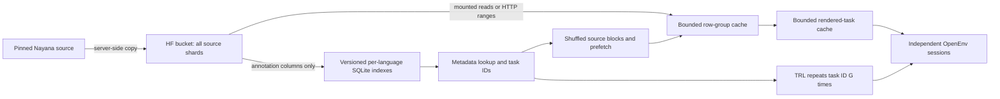

# 06 · Multilingual OCR

<div align="center">

[](https://huggingface.co/collections/FineEnvs/multilingual-multimodal-envs-6ac0c27c137f93e0799603e4)
[](https://huggingface.co/spaces/FineEnvs/nayana-ocr-env)
[](https://huggingface.co/FineEnvs/gemma-4-E4B-it-kannada-ocr-grpo)
[](https://huggingface.co/spaces/FineEnvs/multilingual-multimodal-trackio)

</div>

> **One OpenEnv server for a million document pages in 22 languages, and a Kannada OCR model trained against it.**

<div align="center">


<sub>Gemma 4 E4B, GRPO on 4,000 Kannada section crops. Right: Sarvam Indic OCR Bench, 300 Kannada crops it never trains on, scored by the benchmark's own metric.</sub>

</div>

The environment serves [CognitiveLab's NayanaOCR_Corpus_2025](https://huggingface.co/datasets/Cognitive-Lab/NayanaOCR_Corpus_2025)
in place: **1,006,170 pages, 22 languages, 1,784 Parquet shards and 813.7 GB**, indexed into
**11,020,101 tasks** across five task families, without copying a page out of the
[bucket](https://huggingface.co/buckets/FineEnvs/NayanaOCR_Corpus_2025_bucket). It also serves
[Sarvam Indic OCR Bench](https://huggingface.co/datasets/sarvamai/indic-ocr-bench) as evaluation-only
splits, with the benchmark's own metrics reported beside the reward.

| Part | Where |
|---|---|
| Environment: server, catalog, rewards, playground, Docker, tests | [`envs/nayana_ocr/`](./envs/nayana_ocr/) |
| GRPO trainer, HF Jobs launcher, live checkpoint evaluation, deployment | [`train/`](./train/) |
| Kannada run: per-checkpoint scores, curves, launch commands | [`results/kannada-grpo/`](./results/kannada-grpo/) |
| Published index manifest and frozen evaluation sets | [`data/`](./data/) |
| Walkthrough notebook | [`notebooks/06_multilingual_ocr.ipynb`](./notebooks/06_multilingual_ocr.ipynb) |
| Exact commands, defaults, provenance | [`REPRODUCE.md`](./REPRODUCE.md) |
| Hosted environment and playground | [FineEnvs/nayana-ocr-env](https://huggingface.co/spaces/FineEnvs/nayana-ocr-env) |
| Trained adapter | [FineEnvs/gemma-4-E4B-it-kannada-ocr-grpo](https://huggingface.co/FineEnvs/gemma-4-E4B-it-kannada-ocr-grpo) |
| Every held-out prediction, curves, logs, job scripts | [FineEnvs/multilingual-multimodal-rl-runs](https://huggingface.co/datasets/FineEnvs/multilingual-multimodal-rl-runs) |
| Training and evaluation dashboard | [FineEnvs/multilingual-multimodal-trackio](https://huggingface.co/spaces/FineEnvs/multilingual-multimodal-trackio) |
| Collection, with the ASR sibling project | [Multilingual Multimodal Envs](https://huggingface.co/collections/FineEnvs/multilingual-multimodal-envs-6ac0c27c137f93e0799603e4) |

## Result: Kannada document OCR

`google/gemma-4-E4B-it` with a LoRA adapter, trained by GRPO on 4,000 Kannada section crops streamed
from the corpus, 500 steps on one A100 (10.5 hours). A second job scored every checkpoint on the
Kannada part of Sarvam Indic OCR Bench as it was saved, using the benchmark's own `metrics.py`.

| Sarvam Indic OCR Bench · Kannada · 300 crops | base | step 300 | change (95% CI) |
|---|---:|---:|---:|
| **Sarvam CER** | 0.4277 | **0.3601** | **−0.068** (−0.083, −0.052) |
| Sarvam WER | 0.773 | 0.748 | −0.025 (−0.037, −0.014) |
| Sarvam word accuracy | 22.7% | 25.2% | |
| loop or catastrophic outputs | 16 | 10 | |
| crops containing another Indic script | 37 (12.3%) | 15 (5.0%) | |
| environment reward | 0.455 | 0.513 | +0.058 |

Changes are paired crop by crop against the untuned base on the same engine. 223 crops improve,
62 get worse. Most of the gain comes in the first 100 steps; held-out CER is flat from step 300 to
500 (0.3602 at step 500), so step 300 is the published adapter. Every checkpoint is in
[`results/kannada-grpo/`](./results/kannada-grpo/).

**What it learned first: stay in the script.** The untuned model writes Devanagari or Latin into
Kannada text. The crop below is at the 25th percentile of improvement, not picked by hand:


| | text | Sarvam CER |
|---|---|---:|
| reference | ಬಯ್ತ - ಅಡಗಿಸಿಟ್ಟ (ದಿವಿಜತತಿ ಬಯ್ತು ಕೈದುವಂ ಅವಸರದೊಳ್ / ಬೇಡೆ ಸುರಭಿಯ ನಕ್ಕಿಸೆ .. .. ಕಯ್ದುವಾದುವಾ / ಗೊರವನೆಲ್ವು: ಸಮಯಪ, ೧೦. ೧೪೨) | |
| base | ಬತ್ತು - ಅಡಗಿಸಿಟ್ಟಿ (ದವಿಚತೇ **वायु** ಕೃಡಮ ಅವಕಾಶದೊಳ / ಬೇದ ಸುರಭೆಯ ನಕ್ಷೆ ... ... ಕಮ್ಯುದದಾ / ಗೌರವ**nel**: ಸಮುಮ, ೧೦.೧೭) | 0.455 |
| step 300 | ಬತ್ತು - ಅಡಗಿಸಿಟಿ (ದಿವಸತೇ ಬತ್ತು ಕಡಮಂ ಅವಕಾಶದೊಳ / ಬೇಡ ಸುರಭಿಯ ನಕ್ಷೆ ... ... ಕಮ್ಯುವಾದುಹಾ / ಗಾರ್ದನಲ್ಯ: ಸಮಯವ, ೧೦.೧೭) | 0.347 |

Word error barely moves and no crop is transcribed exactly: the remaining errors are a letter or two
inside most words, which a character reward fixes slowly and a word metric does not credit.

### How it trains


The environment owns the task and the reward; the trainer only ever sees task IDs. TRL's
`GRPOTrainer` resets one OpenEnv session per rollout through `environment_factory`, samples 8
transcriptions per crop, and asks the server to grade each. Each saved checkpoint writes a hash
manifest beside its adapter; a second job (`eval_vllm.py --watch`) follows the run's bucket, loads
each complete adapter into one vLLM engine, scores it on the benchmark, and logs the curve, plots
and paired intervals to Trackio. Commands are in [`train/README.md`](./train/README.md).

## Tasks and reward

| Task | Observation | Answer | Reward |
|---|---|---|---|
| `page_ocr` | Native-size page, with unannotated areas masked | Annotated text in geometric reading order | `0.8 × max(0, 1−CER) + 0.2 × exact_match` |
| `section_ocr` | Lossless crop of an annotated region | Transcription in its source language | Same OCR reward |
| `mcq_vqa` | Original page JPEG, question, options | Uppercase option letter | Exact letter match |
| `layout_detection` | Original page and its pixel dimensions | JSON array of labeled pixel boxes | Mean class-aware region F1 at IoU .50:.05:.95 |
| `descriptive_vqa` | Original page and question | Concise free-form answer | Strict Gemma judge: all six checks must pass |


The [playground](https://fineenvs-nayana-ocr-env.hf.space/web/) has language/task filters,
indexed navigation, shuffle, a page viewer, layout overlays, scoring, and reference reveal after submission.
The OpenEnv observation and discovery APIs exclude reference answers. The public UI deliberately
reveals them after scoring, matching the LaTeX OCR interaction.


<!-- BEGIN:matrix -->
| Env | Tools | Backend | `openenv` |
|---|---|---|---|
| **nayana_ocr** | — | `http` | ✅ |
<!-- END:matrix -->

## Data flow



- **All pages are addressable.** The build reads every shard's annotations and records physical
  file, row group, and row offsets. It derives all eligible tasks, with no page-window limit.
  Metadata queries do not fetch JPEGs. Each language's SQLite index is copied to local disk
  lazily and checksum-verified; SQLite is never queried through a remote mount.
- **Images load on demand.** Source JPEGs stay in Parquet in the bucket. Locally the server can
  issue validated HTTP range requests or read a mounted/downloaded source directory. The Space
  attaches the same bucket at `/corpus`, read-only. Its image contains code and the manifest.
- **Training uses physical locality.** A seeded block order visits every selected task once per
  epoch, shuffling bounded metadata chunks within each block. Prefetch overlaps upcoming reads;
  GRPO owns repetition of each task ID. This is a natural-proportion full pass. Evaluation uses
  a frozen, block-local 500-task set: 100 per family, 22-23 per language, every task load-checked
  and pinned. See [REPRODUCE.md](REPRODUCE.md#8-fixed-evaluation-set).
- **Caches have explicit budgets.** Defaults: 6 GB index files (the published 22-language
  set is 4.30 GB), 4 GB row groups, 512 MB rendered tasks; at most two concurrent cold group loads and four pending prefetches. Reader leases
  protect active files from eviction. Concurrent requests share loads and renders. An evicted
  asset can be reconstructed from its pinned task ID and verified hash.
- **Replay follows source identity.** IDs include the immutable index snapshot. Document-based
  splits keep all pages and languages of a document together. Cold source reads check the
  expected bucket object identity; a changed snapshot or source fails explicitly.

**Cold random access has a real cost:** source row groups generally contain 100 pages and
a median of 75 MB of compressed JPEG data (95th percentile: 116 MB). This implementation caches those groups; it does not
claim one-page network reads or convert all images into new objects. Adjacent tasks and repeated
rollouts reuse them. Cache limits cover published cache files; loading, decoding, and responses
also need transient memory/disk. See [REPRODUCE.md](REPRODUCE.md) for budgets and measurements.

## Run it

From this directory, use the committed manifest for the published full index:

```bash
NAYANA_CORPUS_MANIFEST="$PWD/data/corpus-manifest.json" \
NAYANA_CACHE_DIR="$PWD/data/corpus-cache-local" \
  uv run --frozen --project envs/nayana_ocr nayana-server
# Open http://localhost:8000/web
```

For descriptive VQA on a local server, use an HF Inference Providers token in
`NAYANA_JUDGE_TOKEN` / `HF_TOKEN` (or your locally saved HF token); see [JUDGE.md](JUDGE.md).

For a mounted bucket, also set `NAYANA_SOURCE_ROOT=/corpus`. An ordinary local copy can use
that root with `NAYANA_LOCAL_SOURCE=true` to verify local SHA-256 values and work offline.
Keep all language index databases next to `manifest.json` for fully offline metadata access.
The [reproduction guide](REPRODUCE.md) covers copying, resumable indexing, publication, mounts,
local serving, training, HF Jobs, deployment, and cursor boundaries.

```bash
# No dataset download: synthetic HTTP/WebSocket/cache smoke.
uv run --frozen --project envs/nayana_ocr nayana-smoke

# Single-GPU GRPO; auto selects the full-corpus iterator for this Space.
uv run --frozen --project envs/nayana_ocr --extra train python train/grpo_nayana.py \
  --env-url https://fineenvs-nayana-ocr-env.hf.space --smoke \
  --output-dir artifacts/local-gpu-smoke
```

The [notebook](notebooks/06_multilingual_ocr.ipynb) uses the same data and training code.
Run outputs and calibration reports go under the ignored `artifacts/` directory. CI runs
regression and transport checks and retains reports as workflow artifacts. See
[REPRODUCE.md](REPRODUCE.md#7-checks-and-task-policy) for local verification and benchmarks.

## Task and evaluation limits

Full-page OCR joins annotated regions using `whitespace-columns-v1`, including RTL column
order for Arabic. It masks unannotated areas because source headers can lack transcription
labels. Incomplete or overlapping region annotations exclude a page from this task. This is
annotated full-page transcription; table reconstruction and semantic reading-order labels are
not supplied. VQA and layout detection preserve original JPEG bytes. Layout uses the six supplied
`layout_type` labels: text, title, caption, table, image, formula; it is document-region detection.
Unknown or incomplete layout annotation sets are excluded (two pages).

Descriptive VQA uses **Gemma 4 31B via DeepInfra on HF Inference Providers**. A correct, complete,
relevant answer with no contradiction, unsupported claims, or grading manipulation receives 1;
otherwise 0. Faithful paraphrases and translations are accepted. The judge compares the question
and corpus reference; it does not independently inspect the image or repair bad source answers.
Transport errors and malformed verdicts raise errors without consuming the episode.
See [JUDGE.md](JUDGE.md) for the rubric, explicit model/provider, calibration, and reproduction.

The full index validates annotations without decoding a million images. Actual image bounds
are validated when a task is loaded; invalid image/annotation pairs fail explicitly. Counts
therefore describe indexed annotation candidates, not an image-quality-audited benchmark.
Serving rejects images above 50 million pixels, including a known 69.7-megapixel source page.
Preflight fixed training/evaluation sets; unattended full-corpus runs need a versioned resize
or eligibility policy. The GRPO recipe is verified on Kannada section OCR (above); the other four
task families have smoke runs, not trained results.
An original Arabic page has known missing/distorted glyphs; the UI flags this source caveat.
Source supervision and language-specific rendering need auditing before making model claims.

**Sarvam Indic OCR Bench** ([sarvamai/indic-ocr-bench](https://huggingface.co/datasets/sarvamai/indic-ocr-bench),
**Sarvam AI**, Apache-2.0) is served beside the corpus as evaluation-only splits:
`indic_ocr_bench_test` (6,908 of its 6,909 human-reviewed text blocks, 23 languages) and
`indic_ocr_bench_small` (1,173). Eleven of its languages - Assamese, Bodo, Dogri, Kashmiri,
Konkani, Maithili, Manipuri, Nepali, Santhali, Sindhi, Urdu - are not in the Nayana corpus.
Every crop is an ordinary Section OCR task with the same reward, so benchmark and corpus
numbers sit on one scale. The benchmark's official CER/WER (its `metrics.py`, vendored
unmodified) are reported beside the reward, and `train/eval_vllm.py --split
indic_ocr_bench_test` also writes its report format: average and valid-sample CER/WER, word
accuracy, loop and missing counts, per-language scores.

Serving mirrors the corpus. [`train/publish_indic_ocr_bench.py`](train/publish_indic_ocr_bench.py)
builds the crops and index once and publishes them to
[FineEnvs/indic-ocr-bench-bucket](https://huggingface.co/buckets/FineEnvs/indic-ocr-bench-bucket);
the Space mounts it at `/indic-ocr-bench`, a job mounts it the same way, and a local server
fetches a split on first use. To evaluate a checkpoint:

```bash
hf jobs uv run --flavor a100-large -s HF_TOKEN \
  -v hf://buckets/FineEnvs/NayanaOCR_Corpus_2025_bucket:/corpus:ro \
  -v hf://buckets/FineEnvs/indic-ocr-bench-bucket:/indic-ocr-bench:ro \
  -e NAYANA_INDIC_OCR_BENCH_ROOT=/indic-ocr-bench \
  train/hf_job.py --revision <commit> --mode eval-vllm --corpus-manifest repo \
  --source-root /corpus --split indic_ocr_bench_small --base google/gemma-4-E4B-it \
  --adapters step-250=/outputs/<rev>/checkpoint-250
```

One test row, `indic_ocr_bench_test_eng_5`, has ground truth but no image in the source data and is not served, so test scores are over 6,908 rather than 6,909. The card says crops are PNG; at the pinned revision some are JPEG (141 of the 1,173 small-split
crops), and are served as such. All credit for the benchmark belongs to Sarvam AI; please cite:

```bibtex
@misc{sarvam-indic-ocr-bench,
  title={Sarvam Indic OCR Bench},
  author={Sarvam AI},
  year={2026},
  url={https://huggingface.co/datasets/sarvamai/indic-ocr-bench}
}
```

OpenEnv already supplies TaskProvider and session transport. This experiment implements the
catalog, bucket adapter, caching, sampling, and OCR policy around those interfaces.
[OPENENV_UPSTREAM.md](OPENENV_UPSTREAM.md) proposes reusable contributions supported by this work.

## Files

```text
envs/nayana_ocr/     OpenEnv package, data adapters, playground, tests, Docker, lockfile
data/               published index manifest and data contract
train/              GRPO, HF Jobs, live checkpoint evaluation, deployment, calibration, benchmarks
results/            smoke records and the Kannada run (kannada-grpo/)
assets/             README figures and the scripts that draw them from the published run data
notebooks/          full-corpus data handling and optional training walkthrough
REPRODUCE.md        exact commands, defaults, provenance, and replay limits
```

Environment code is Apache-2.0. Source data, copied annotations, and derived images retain
**CC BY-NC 4.0** and CognitiveLab attribution; see [data/README.md](data/README.md).

## Citation

```bibtex
@misc{fineenvs,
  author = {Kolavi, Adithya S},
  title  = {FineEnvs: Open Source RL Environments for LLM Agents},
  year   = {2026},
  url    = {https://github.com/adithya-s-k/FineEnvs}
}
```
