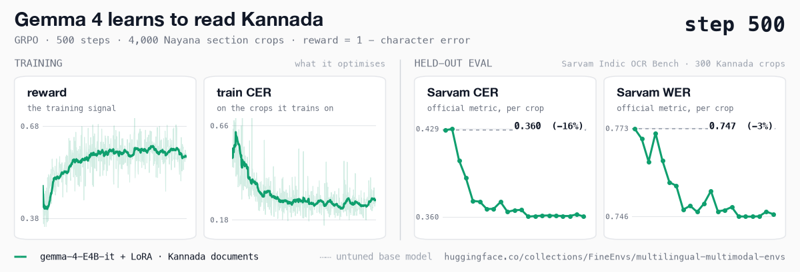
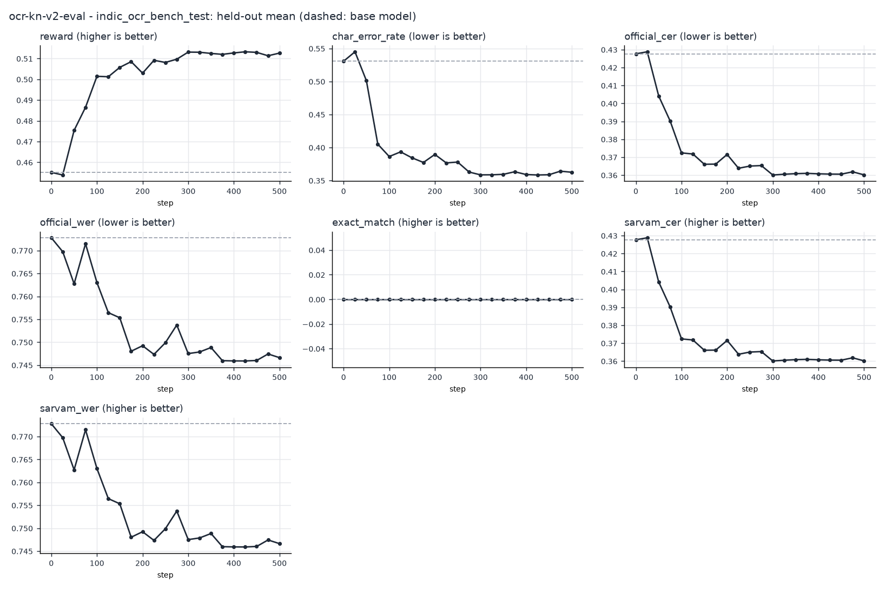
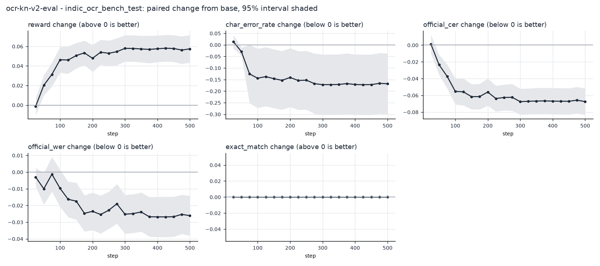
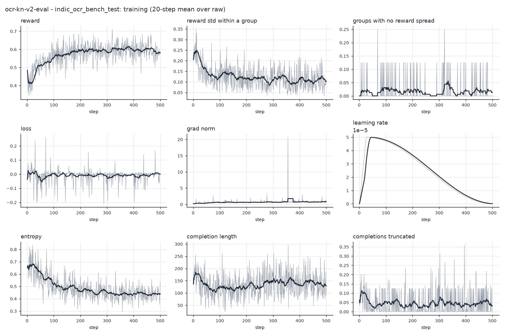

# Kannada OCR: GRPO on Nayana section crops, scored on Sarvam Indic OCR Bench

`google/gemma-4-E4B-it` + LoRA, GRPO on 4,000 distinct Kannada section crops streamed from the corpus (500 steps × 8 crops × 8 transcriptions) on one A100 in 10.5 hours. Every checkpoint was scored on the 300 Kannada crops of Sarvam Indic OCR Bench (`test`) by a second job as it was saved: greedy vLLM decoding, graded by the same environment, with the benchmark's own `metrics.py` for Sarvam CER/WER.



Published adapter: **step 300**, [FineEnvs/gemma-4-E4B-it-kannada-ocr-grpo](https://huggingface.co/FineEnvs/gemma-4-E4B-it-kannada-ocr-grpo), the best Sarvam CER of all 20 checkpoints; step 500 scores the same (0.3602).

## Every checkpoint

Change is paired item by item against the untuned base, with a 95% interval. Sarvam CER/WER are the benchmark's own, capped at 1 per crop by its `metrics.py`. Env CER is the environment's NFC character error, capped at 1 per crop here.

| step | Sarvam CER | Sarvam WER | env CER | reward | change in Sarvam CER (95% CI) |
|---:|---:|---:|---:|---:|---:|
| base | 0.4277 | 0.7728 | 0.4311 | 0.4552 |  |
| 25 | 0.4288 | 0.7698 | 0.4326 | 0.4539 | +0.0011 (-0.0099, +0.0122) |
| 50 | 0.4042 | 0.7627 | 0.4058 | 0.4754 | -0.0235 (-0.0355, -0.0115) |
| 75 | 0.3903 | 0.7715 | 0.3919 | 0.4865 | -0.0374 (-0.0517, -0.0231) |
| 100 | 0.3724 | 0.7630 | 0.3732 | 0.5014 | -0.0553 (-0.0708, -0.0397) |
| 125 | 0.3718 | 0.7564 | 0.3734 | 0.5012 | -0.0559 (-0.0720, -0.0397) |
| 150 | 0.3661 | 0.7553 | 0.3678 | 0.5058 | -0.0616 (-0.0766, -0.0467) |
| 175 | 0.3662 | 0.7480 | 0.3644 | 0.5085 | -0.0615 (-0.0768, -0.0462) |
| 200 | 0.3716 | 0.7492 | 0.3713 | 0.5030 | -0.0561 (-0.0724, -0.0398) |
| 225 | 0.3638 | 0.7473 | 0.3635 | 0.5092 | -0.0638 (-0.0792, -0.0485) |
| 250 | 0.3651 | 0.7499 | 0.3648 | 0.5081 | -0.0626 (-0.0781, -0.0471) |
| 275 | 0.3653 | 0.7538 | 0.3629 | 0.5097 | -0.0623 (-0.0784, -0.0463) |
| **300** | 0.3601 | 0.7475 | 0.3586 | 0.5131 | -0.0676 (-0.0830, -0.0521) |
| 325 | 0.3605 | 0.7479 | 0.3587 | 0.5130 | -0.0672 (-0.0827, -0.0516) |
| 350 | 0.3608 | 0.7488 | 0.3594 | 0.5125 | -0.0668 (-0.0824, -0.0513) |
| 375 | 0.3610 | 0.7460 | 0.3600 | 0.5120 | -0.0667 (-0.0824, -0.0509) |
| 400 | 0.3607 | 0.7459 | 0.3591 | 0.5127 | -0.0669 (-0.0826, -0.0512) |
| 425 | 0.3606 | 0.7459 | 0.3584 | 0.5133 | -0.0671 (-0.0828, -0.0513) |
| 450 | 0.3605 | 0.7460 | 0.3588 | 0.5130 | -0.0671 (-0.0828, -0.0514) |
| 475 | 0.3619 | 0.7474 | 0.3608 | 0.5114 | -0.0658 (-0.0816, -0.0500) |
| 500 | 0.3602 | 0.7466 | 0.3592 | 0.5126 | -0.0675 (-0.0834, -0.0516) |





## Reproduce

Training, at commit [`6e8dd18`](https://github.com/adithya-s-k/FineEnvs/commit/6e8dd1825baa127d58ba828fc67c6eb0b52b2599) (job `6abff37afbc85ba682372c8b`, a100-large, 10.5 h):

```bash
hf jobs uv run -d --flavor a100-large -s HF_TOKEN --timeout 14h -e NAYANA_INDIC_OCR_BENCH_ROOT=/indic-ocr-bench \
  -v hf://buckets/FineEnvs/NayanaOCR_Corpus_2025_bucket:/corpus:ro \
  -v hf://buckets/FineEnvs/indic-ocr-bench-bucket:/indic-ocr-bench:ro \
  -v hf://buckets/AdithyaSK/fineenvs-ocr-runs:/outputs \
  train/hf_job.py --revision 6e8dd1825baa127d58ba828fc67c6eb0b52b2599 --mode train --corpus-manifest repo --source-root /corpus --output-root /outputs --evalset eval-nayana-kn-section-validation.json \
  --model google/gemma-4-E4B-it --languages kn --families section_ocr --max-steps 500 --num-generations 8 --gradient-accumulation-steps 8 --max-completion-length 512 --learning-rate 5e-5 --lr-scheduler-type cosine --warmup-ratio 0.05 --eval-limit 48 --save-steps 25 --save-total-limit 30 --trackio-space AdithyaSK/fineenvs-ocr-trackio --run-name ocr-kn-v2
```

Live evaluation of every checkpoint (job `6ac00aabfbc85ba682373660`):

```bash
hf jobs uv run -d --flavor a100-large -s HF_TOKEN --timeout 14h -e NAYANA_INDIC_OCR_BENCH_ROOT=/indic-ocr-bench \
  -v hf://buckets/FineEnvs/NayanaOCR_Corpus_2025_bucket:/corpus:ro \
  -v hf://buckets/FineEnvs/indic-ocr-bench-bucket:/indic-ocr-bench:ro \
  -v hf://buckets/AdithyaSK/fineenvs-ocr-runs:/outputs \
  train/hf_job.py --revision 6e8dd1825baa127d58ba828fc67c6eb0b52b2599 --mode eval-vllm --corpus-manifest repo --source-root /corpus --output-root /outputs --split indic_ocr_bench_test --languages kn \
  --base google/gemma-4-E4B-it --watch AdithyaSK/fineenvs-ocr-runs/6e8dd1825baa127d58ba828fc67c6eb0b52b2599 --follow-job 6abff37afbc85ba682372c8b --output-dir /outputs/6e8dd1825baa127d58ba828fc67c6eb0b52b2599/evals --trackio-space AdithyaSK/fineenvs-ocr-trackio --run-name ocr-kn-v2-eval
```

The commands ran when this folder was `05-multilingual-ocr`; replace the `AdithyaSK/...` output buckets
and Trackio Spaces with your own. `curve.json` here and
[FineEnvs/multilingual-multimodal-rl-runs](https://huggingface.co/datasets/FineEnvs/multilingual-multimodal-rl-runs)
(`ocr-kannada/`) hold the full record: every held-out prediction, the trainer log, and the job
scripts at that commit.
