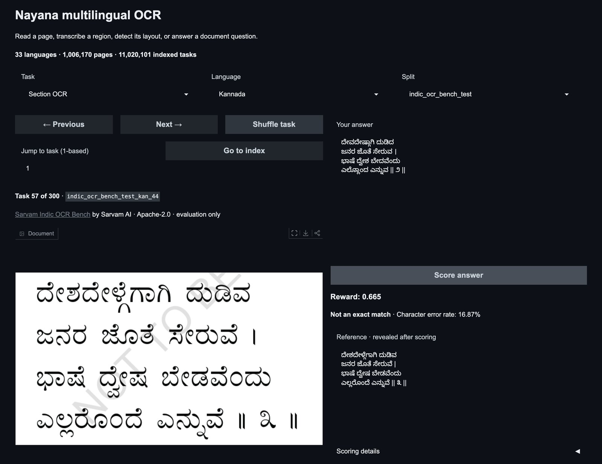

<div align="center">

<h1>Multilingual</h1>

<h3>Reading and hearing many languages, as two OpenEnv environments</h3>

<p>A million document pages in 22 languages and read speech in 102, each behind one server, and a Gemma 4 trained on each to read and to hear Kannada.</p>

<a href="https://huggingface.co/spaces/FineEnvs/nayana-ocr-env"></a>
<a href="https://huggingface.co/spaces/FineEnvs/fleurs-asr-env"></a>
<a href="https://huggingface.co/collections/FineEnvs/multilingual-multimodal-envs-6ac0c27c137f93e0799603e4"></a>
<a href="https://github.com/huggingface/OpenEnv"></a>

</div>

---

This project has two halves. They share a model, a training recipe and a way of scoring
checkpoints, but each is a separate environment with its own folder, dependencies and Space.

| | [**ocr/**](./ocr/) | [**asr/**](./asr/) |
|---|---|---|
| The task | read a crop or a page and write out the text | hear a clip and write down what was said |
| The data | [Nayana](https://huggingface.co/datasets/Cognitive-Lab/NayanaOCR_Corpus_2025): 1,006,170 pages, 22 languages, 11 million tasks | [FLEURS](https://huggingface.co/datasets/google/fleurs): 102 languages, 1,151,940 tasks |
| Also served | [Sarvam Indic OCR Bench](https://huggingface.co/datasets/sarvamai/indic-ocr-bench), as evaluation splits | the FLEURS test and validation splits |
| Play with it | [nayana-ocr-env](https://huggingface.co/spaces/FineEnvs/nayana-ocr-env) | [fleurs-asr-env](https://huggingface.co/spaces/FineEnvs/fleurs-asr-env) |
| Trained model | [kannada-ocr-grpo](https://huggingface.co/FineEnvs/gemma-4-E4B-it-kannada-ocr-grpo) | [kannada-asr-grpo](https://huggingface.co/FineEnvs/gemma-4-E4B-it-kannada-asr-grpo) |

Pick a half and start from its README. Each one has its own DESIGN, LEARNINGS and REPRODUCE pages.

## Reading: Kannada OCR



Gemma 4 E4B, trained with GRPO on 4,000 Kannada text crops from Nayana, makes **16% fewer character
errors** on the Kannada part of Sarvam Indic OCR Bench, which it never trained on. 500 steps, one
A100, 10.5 hours.

| Sarvam Indic OCR Bench, Kannada, 300 crops | base | trained | change, 95% CI |
|---|---:|---:|---:|
| **character error rate** | 0.4277 | **0.3601** | −0.068 (−0.083, −0.052) |
| word error rate | 0.773 | 0.748 | −0.025 (−0.037, −0.014) |
| outputs that slip into another script | 12.3% | 5.0% | |

The error rates are Sarvam's own, from the benchmark's `metrics.py`. Most of the gain is the model
learning to stay in the Kannada script, and the curve is flat from step 300. **[More in ocr/ →](./ocr/)**

## Hearing: Kannada ASR


Gemma 4 E4B, trained with GRPO on every Kannada clip in FLEURS, makes **45% fewer character errors**
on the 838 Kannada test clips. One epoch, 575 steps, one A100, 4.7 hours.

| FLEURS Kannada test, 838 clips | base | trained | change, 95% CI |
|---|---:|---:|---:|
| **character error rate** | 0.1047 | **0.0571** | −0.048 (−0.057, −0.039) |
| word error rate | 0.312 | 0.243 | −0.069 (−0.079, −0.059) |
| transcripts that slip into another script | 20.8% | 1.6% | |

It only worked once the trainer actually fed the model the audio. TRL 1.13 drops audio features from
the forward pass its loss comes from, so earlier runs trained on transcripts the model had not heard.
Images are not dropped, which is why the OCR half never had the problem. **[More in asr/ →](./asr/)**

## What the two have in common

- **The environment owns the task and the reward.** The trainer handles task IDs only. Both runs
  trained on `0.8 × (1 − character error) + 0.2 × exact match`.
- **The data stays in a bucket.** Pages and clips are fetched one at a time, so neither corpus is
  downloaded up front.
- **Every checkpoint is scored while the run trains.** A second job follows the run's bucket, loads
  each new adapter into one vLLM engine, scores it on held-out data, and logs it to Trackio.
- **Every change is paired** item by item against the untuned model, with a 95% interval.

Both runs, the curves and every held-out prediction are in
[`multilingual-multimodal-rl-runs`](https://huggingface.co/datasets/FineEnvs/multilingual-multimodal-rl-runs),
and the training curves are in
[`multilingual-multimodal-trackio`](https://huggingface.co/spaces/FineEnvs/multilingual-multimodal-trackio).

## Layout

```
06-multilingual/
├── ocr/                    the Nayana OCR environment and the Kannada OCR run
│   ├── envs/nayana_ocr/        the environment, the benchmark, the playground, tests
│   ├── train/                  GRPO, the HF Jobs launcher, live checkpoint scoring, deployment
│   ├── results/kannada-grpo/   every checkpoint's score, the figures, the exact commands
│   ├── data/ notebooks/ assets/
│   └── README.md  DESIGN.md  LEARNINGS.md  JUDGE.md  REPRODUCE.md
└── asr/                    the FLEURS ASR environment and the Kannada ASR run
    ├── envs/multilingual_asr/  the environment, the playground, the audio-aware trainer, tests
    ├── train/                  GRPO, the HF Jobs launcher, live checkpoint scoring, deployment
    ├── results/kannada-grpo/   every checkpoint's score, the figures, the exact commands
    ├── data/ notebooks/ assets/
    └── README.md  DESIGN.md  LEARNINGS.md  REPRODUCE.md
```

The two environments are separate uv projects with separate lockfiles. Run each half's commands
from inside its folder.

## The environments

<!-- BEGIN:matrix -->
| Env | Tools | Backend | `openenv` |
|---|---|---|---|
| **nayana_ocr** | — | `http` | ✅ |
| **multilingual_asr** | — | `http` | ✅ |
<!-- END:matrix -->

## Licenses

The code is Apache-2.0. Nayana pages and annotations are CognitiveLab's **CC BY-NC 4.0**, and so is
the OCR adapter trained on them. Sarvam Indic OCR Bench is Apache-2.0, and all credit for it belongs
to Sarvam AI. FLEURS is CC BY 4.0.

## Citation

```bibtex
@misc{fineenvs,
  author = {Kolavi, Adithya S},
  title  = {FineEnvs: Open Source RL Environments for LLM Agents},
  year   = {2026},
  url    = {https://github.com/adithya-s-k/FineEnvs}
}

@misc{sarvam-indic-ocr-bench,
  title  = {Sarvam Indic OCR Bench},
  author = {Sarvam AI},
  year   = {2026},
  url    = {https://huggingface.co/datasets/sarvamai/indic-ocr-bench}
}

@inproceedings{conneau2023fleurs,
  title     = {FLEURS: Few-shot Learning Evaluation of Universal Representations of Speech},
  author    = {Conneau, Alexis and Ma, Min and Khanuja, Simran and Zhang, Yu and Axelrod, Vera and
               Dalmia, Siddharth and Riesa, Jason and Rivera, Clara and Bapna, Ankur},
  booktitle = {IEEE Spoken Language Technology Workshop (SLT)},
  year      = {2023}
}
```
