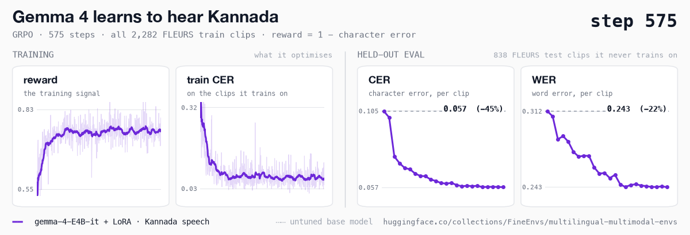
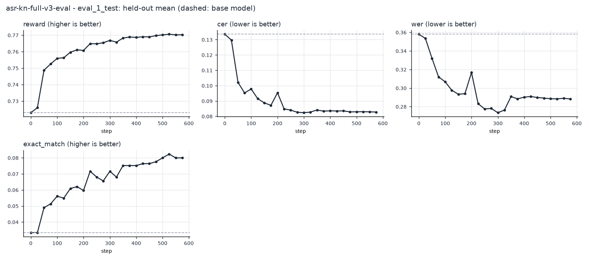
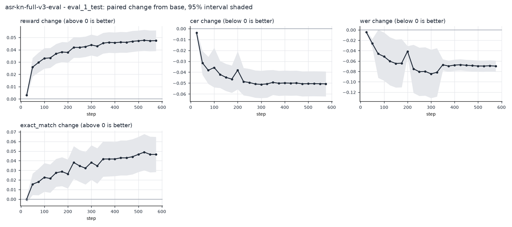
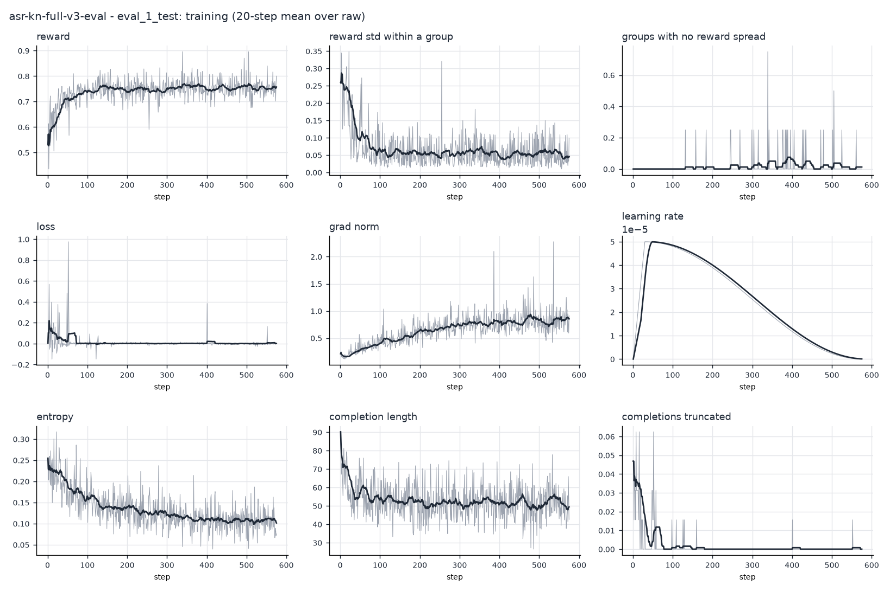

# The Kannada ASR run

Gemma 4 E4B with a LoRA adapter, trained with GRPO on all 2,282 Kannada clips in FLEURS: one epoch,
575 steps, 16 transcripts per clip and 4 clips per step, rewarded on character error. It ran on one
A100 for 4.7 hours. While it trained, a second job scored every checkpoint on the 838 Kannada test
clips, with greedy decoding, graded by the same environment.



The published adapter is the last checkpoint, **step 575**:
[FineEnvs/gemma-4-E4B-it-kannada-asr-grpo](https://huggingface.co/FineEnvs/gemma-4-E4B-it-kannada-asr-grpo).
It has the lowest error of all 23.

## Every checkpoint

Each change is measured clip by clip against the untuned model, with a 95% interval. Error rates
are capped at 1 per clip before averaging, so a single transcript that loops cannot swing a
checkpoint. The uncapped means and every clip's prediction are in the
[runs dataset](https://huggingface.co/datasets/FineEnvs/multilingual-multimodal-rl-runs).

| step | CER | WER | reward | change in CER (95% CI) |
|---:|---:|---:|---:|---:|
| base | 0.1047 | 0.3118 | 0.7229 |  |
| 25 | 0.1009 | 0.3072 | 0.7260 | -0.0038 (-0.0066, -0.0011) |
| 50 | 0.0763 | 0.2864 | 0.7487 | -0.0284 (-0.0368, -0.0200) |
| 75 | 0.0722 | 0.2892 | 0.7525 | -0.0326 (-0.0414, -0.0237) |
| 100 | 0.0691 | 0.2843 | 0.7559 | -0.0356 (-0.0448, -0.0264) |
| 125 | 0.0683 | 0.2749 | 0.7563 | -0.0364 (-0.0452, -0.0275) |
| 150 | 0.0656 | 0.2706 | 0.7597 | -0.0391 (-0.0480, -0.0302) |
| 175 | 0.0642 | 0.2715 | 0.7611 | -0.0406 (-0.0496, -0.0315) |
| 200 | 0.0640 | 0.2712 | 0.7607 | -0.0407 (-0.0500, -0.0315) |
| 225 | 0.0619 | 0.2607 | 0.7648 | -0.0429 (-0.0520, -0.0337) |
| 250 | 0.0610 | 0.2551 | 0.7648 | -0.0437 (-0.0528, -0.0346) |
| 275 | 0.0597 | 0.2558 | 0.7654 | -0.0451 (-0.0541, -0.0360) |
| 300 | 0.0593 | 0.2511 | 0.7668 | -0.0454 (-0.0544, -0.0363) |
| 325 | 0.0598 | 0.2540 | 0.7658 | -0.0449 (-0.0540, -0.0358) |
| 350 | 0.0585 | 0.2454 | 0.7683 | -0.0463 (-0.0553, -0.0372) |
| 375 | 0.0577 | 0.2429 | 0.7689 | -0.0470 (-0.0561, -0.0380) |
| 400 | 0.0579 | 0.2448 | 0.7687 | -0.0468 (-0.0559, -0.0377) |
| 425 | 0.0578 | 0.2454 | 0.7690 | -0.0469 (-0.0560, -0.0378) |
| 450 | 0.0579 | 0.2443 | 0.7689 | -0.0468 (-0.0559, -0.0377) |
| 475 | 0.0572 | 0.2438 | 0.7698 | -0.0475 (-0.0566, -0.0384) |
| 500 | 0.0573 | 0.2430 | 0.7702 | -0.0474 (-0.0565, -0.0384) |
| 525 | 0.0573 | 0.2430 | 0.7706 | -0.0474 (-0.0565, -0.0383) |
| 550 | 0.0572 | 0.2435 | 0.7702 | -0.0475 (-0.0565, -0.0384) |
| **575** | 0.0571 | 0.2428 | 0.7703 | -0.0476 (-0.0567, -0.0385) |





## Run it again

Training, at commit [`ac63930`](https://github.com/adithya-s-k/FineEnvs/commit/ac6393008d78527aeb1f17a61c3f89471382fc5f) (job `6abff1acfbc85ba682372b98`, a100-large, 4.7 h):

```bash
hf jobs uv run -d --flavor a100-large -s HF_TOKEN --timeout 14h \
  -v hf://buckets/FineEnvs/fleurs-bucket:/fleurs:ro \
  -v hf://buckets/AdithyaSK/fineenvs-asr-runs:/outputs \
  train/hf_job.py --revision ac6393008d78527aeb1f17a61c3f89471382fc5f --mode train --source-root /fleurs --output-root /outputs \
  --model google/gemma-4-E4B-it --languages kn_in --families transcription --train-per-group 2282 --max-steps 575 --num-generations 16 --gradient-accumulation-steps 4 --max-completion-length 448 --learning-rate 5e-5 --lr-scheduler-type cosine --warmup-ratio 0.05 --reward-unit cer --eval-split eval_1_validation --eval-limit 48 --save-steps 25 --save-total-limit 30 --trackio-space AdithyaSK/fineenvs-asr-trackio --run-name asr-kn-full-v3
```

Live evaluation of every checkpoint (job `6abff1b6fbc85ba682372b9d`):

```bash
hf jobs uv run -d --flavor l40sx1 -s HF_TOKEN --timeout 16h \
  -v hf://buckets/FineEnvs/fleurs-bucket:/fleurs:ro \
  -v hf://buckets/AdithyaSK/fineenvs-asr-runs:/outputs \
  train/hf_job.py --revision ac6393008d78527aeb1f17a61c3f89471382fc5f --mode eval-vllm --source-root /fleurs --output-root /outputs \
  --base google/gemma-4-E4B-it --watch AdithyaSK/fineenvs-asr-runs/ac6393008d78527aeb1f17a61c3f89471382fc5f --follow-job 6abff1acfbc85ba682372b98 --eval-split eval_1_test --max-new-tokens 448 --reward-unit cer --output-dir /outputs/ac6393008d78527aeb1f17a61c3f89471382fc5f/evals --trackio-space AdithyaSK/fineenvs-asr-trackio --run-name asr-kn-full-v3-eval
```

These commands ran when this folder was still called `06-multilingual-asr`, and `--revision` pins that layout; the tag `kannada-asr-run` keeps that commit. To
run again from `06-multilingual/asr/`, use [`train/README.md`](../../train/README.md) with a current commit. Swap the `AdithyaSK/...` output bucket
and Trackio Space for your own. `curve.json` here and
[FineEnvs/multilingual-multimodal-rl-runs](https://huggingface.co/datasets/FineEnvs/multilingual-multimodal-rl-runs)
(`asr-kannada/`) hold the full record: every held-out prediction, the trainer log, and the job
scripts at that commit.
