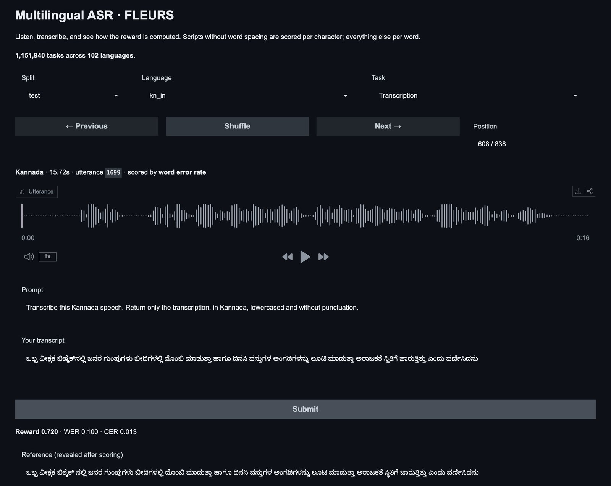
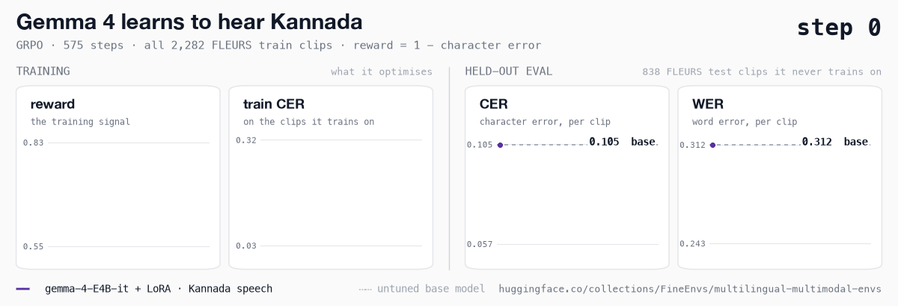
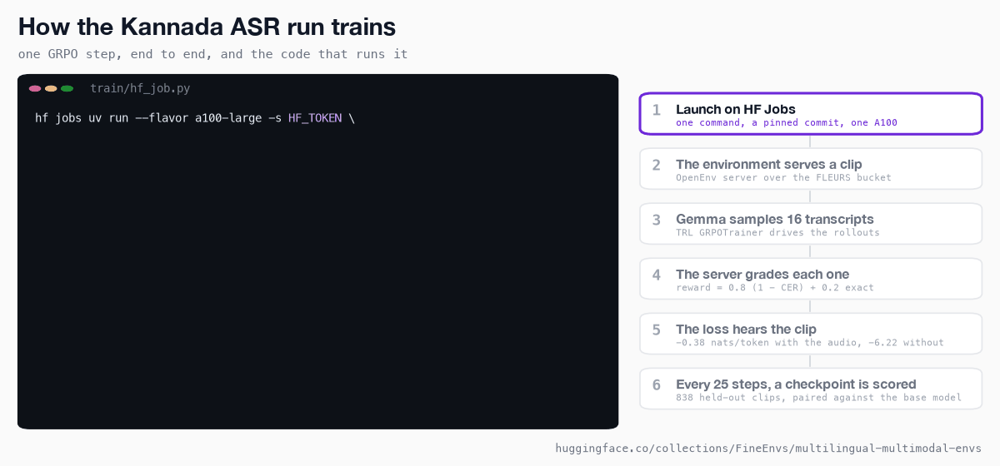

<div align="center">



<h1>Multilingual ASR</h1>

<h3>Every language in FLEURS, behind one OpenEnv server</h3>

<p>102 languages of read speech as an RL environment, and a Gemma 4 that learned to transcribe Kannada once the trainer let it hear the audio.</p>

<a href="https://huggingface.co/spaces/FineEnvs/fleurs-asr-env"></a>
<a href="https://huggingface.co/FineEnvs/gemma-4-E4B-it-kannada-asr-grpo"></a>
<a href="https://huggingface.co/collections/FineEnvs/multilingual-multimodal-envs-6ac0c27c137f93e0799603e4"></a>
<a href="https://github.com/huggingface/OpenEnv"></a>

</div>

---

## The result

Gemma 4 E4B, trained with GRPO on every Kannada clip in FLEURS, makes **45% fewer character
errors** on the 838 Kannada test clips it never trained on. One epoch, 575 steps, one A100, 4.7 hours.



| FLEURS Kannada test, 838 clips | base | trained | change, 95% CI |
|---|---:|---:|---:|
| **character error rate** | 0.1047 | **0.0571** | −0.048 (−0.057, −0.039) |
| word error rate | 0.312 | 0.243 | −0.069 (−0.079, −0.059) |
| exact transcripts | 3.3% | 8.0% | |
| transcripts that slip into another script | 20.8% | 1.6% | |

Each change is paired clip by clip against the untuned model, on the same vLLM engine, graded by
the same environment that produced the training reward. Error rates are capped at 1 per clip, so a
single transcript that loops cannot move the average. 565 clips get better and 139 get worse.

The earlier Kannada runs raised training reward and barely moved the held-out score. Read
[why](#the-trainer-never-heard-the-audio) before trusting a speech RL curve, including this one.

## What this is

You hear fifteen seconds of someone reading a sentence aloud. You write down what they said. A
server compares your transcript with the reference and pays you for every character you got right.

That is [FLEURS](https://huggingface.co/datasets/google/fleurs), Google's read-speech benchmark,
built as an [OpenEnv](https://github.com/huggingface/OpenEnv) environment: 102 languages and
1,151,940 tasks. A task is a plain transcript, a verbatim one with case and punctuation, or the
name of the language being spoken. The audio stays in a
[bucket](https://huggingface.co/buckets/FineEnvs/fleurs-bucket) and is fetched one clip at a time,
so nothing is downloaded up front.

It suits RL for three reasons:
- **The reward is continuous.** Sixteen transcripts of the same clip all differ a little, so every
  group has spread to learn from.
- **The answer is fixed.** There is a reference transcript, so no rubric and no judge to game.
- **It is not solved.** The untuned model misses one Kannada character in ten.

## What it learned

It learned to stay in Kannada.

One transcript in five from the untuned model switches script mid-word. It writes a Gujarati or
Malayalam letter where the Kannada one belongs, and occasionally a Latin syllable. After training
that happens in one transcript in sixty. A clip at the median improvement:

| | transcript | CER |
|---|---|---:|
| reference | **ತಾಂತ್ರಿಕ** ನಿರ್ಣಾಯಕತೆಯ ಹೆಚ್ಚಿನ ವ್ಯಾಖ್ಯಾನಗಳು … **ಅವುಗಳೆಂದರೆ** ತಂತ್ರಜ್ಞಾನದ … | |
| before | **ತಾന്ത്രിಕ** ನಿರ್ಣಾಯಕತೀಯ ಹೆಚ್ಚಿನ ವ್ಯಾಖ್ಯಾನಗಳು … **ಅವು ಎಂದರೆ** ತಂತ್ರಜ್ಞಾನದ … | 0.047 |
| after | **ತಾಂತ್ರಿಕ** ನಿರ್ಣಾಯಕತೆಯೇ ಹೆಚ್ಚಿನ ವ್ಯಾಖ್ಯಾನಗಳು … **ಅವುಗಳೆಂದರೆ** ತಂತ್ರಜ್ಞಾನದ … | 0.010 |

Most of that happens in the first 150 steps. After that the gains are a letter here and there, and
the curve is flat from about step 250. The transcripts also get shorter, from about 80 tokens to 48,
as the model stops repeating itself: ten clips looped before training, one after.

Word error moves less than character error, and that is expected. A Kannada word is a long,
inflected string, so a single wrong vowel sign makes the whole word wrong.

## The trainer never heard the audio

The earlier Kannada runs looked healthy. Training reward climbed, the loss was stable, and the
adapter weights moved. On held-out clips almost nothing changed.

The cause was in TRL. GRPO computes its loss from a second forward pass over the prompt and the
sampled transcript. TRL 1.13 passes image features into that pass, but it drops audio features. So
the model generated its transcripts while listening, and was then graded on how likely those
transcripts were *without* the audio. The gradient was teaching a language model the training
sentences, not teaching it to listen.

It is easy to measure once you look. On the first batch of this run, the sampled transcripts score
**−0.38 nats per token with the clip and −6.22 without it**. Every earlier run took its gradient
against the second number.

[`AudioGRPOTrainer`](./envs/multilingual_asr/training.py) carries each batch's audio features into
every log-prob pass, and checks on the first batch that they arrive. Two smaller fixes went in with it:
- **The reward counts characters, not words.** An earlier run cut character errors by 14% while
  word errors moved 2%, because the reward could not see a word that was nearly right.
- **Padding is masked.** Batching used to pad every clip to 30 seconds of silence, which the model
  heard as speech.

The OCR sibling project never had this problem, because images do reach the loss. The whole story,
with the numbers, is in [LEARNINGS.md](./LEARNINGS.md).

## How a training step works



The environment owns the task and the reward. The trainer only ever handles task IDs: TRL's
`GRPOTrainer` opens one OpenEnv session per rollout, the model writes sixteen transcripts of the
clip, and the server grades each one.

Every 25 steps a checkpoint is saved. A second job follows the run's bucket, loads each new adapter
into one vLLM engine, scores it on the held-out clips, and logs the result to Trackio. You can read
the curve while the run is still going.

## Layout

```
07-multilingual-asr/
├── envs/multilingual_asr/   the environment: server, rewards, playground, the audio-aware trainer, tests
├── train/                   GRPO, the HF Jobs launcher, live checkpoint scoring, Space deployment
├── results/kannada-grpo/    every checkpoint's score, the figures, the exact commands
├── data/                    the committed corpus index and six frozen evaluation sets
├── notebooks/               listen, score, and compare before and after training, on a CPU
└── assets/                  the images above, and the scripts that draw the GIFs from the published data
```

[DESIGN.md](./DESIGN.md) explains how the environment works, [LEARNINGS.md](./LEARNINGS.md) what
the runs taught, and [REPRODUCE.md](./REPRODUCE.md) gives every command.

## Try it

Nothing to install. **[Open the Space](https://fineenvs-fleurs-asr-env.hf.space/web/)**, pick a
language, listen to a clip, type what you hear, and see how it scores. The
[notebook](./notebooks/07_multilingual_asr.ipynb) does the same from Python, and shows what the
model wrote before and after training.

To serve the whole corpus yourself, from the committed index:

```bash
FLEURS_CORPUS_MANIFEST="$PWD/data/corpus-manifest.json" \
  uv run --frozen --project envs/multilingual_asr asr-server     # port 8006

uv run --frozen --project envs/multilingual_asr asr-smoke         # no download at all
```

To train, [`train/README.md`](./train/README.md) has the two HF Jobs commands that produced the run
above, one for training and one for the live evaluation.

## The environment

<!-- BEGIN:matrix -->
| Env | Tools | Backend | `openenv` |
|---|---|---|---|
| **multilingual_asr** | — | `http` | ✅ |
<!-- END:matrix -->

| Task | You hear | You answer | Reward |
|---|---|---|---|
| `transcription` | a 16 kHz clip | what was said, lowercase, no punctuation | `0.8 × (1 − error rate) + 0.2 × exact match` |
| `verbatim_transcription` | the same clip | what was said, with case and punctuation | the same, on the raw text |
| `language_id` | the same clip | the FLEURS language code | exact match |

The error rate is per word for languages that put spaces between words, and per character for
the seven that do not, such as Mandarin and Thai. A word error rate on those would mark any
mistake as a total miss. FLEURS' own train, validation and test splits are used as published.
[DESIGN.md](./DESIGN.md) covers the scoring rules, the index, and the frozen evaluation sets.

## Published

| | |
|---|---|
| Environment | [`fleurs-asr-env`](https://huggingface.co/spaces/FineEnvs/fleurs-asr-env) |
| Trained model | [`gemma-4-E4B-it-kannada-asr-grpo`](https://huggingface.co/FineEnvs/gemma-4-E4B-it-kannada-asr-grpo) |
| Every prediction, curve and job script | [`multilingual-multimodal-rl-runs`](https://huggingface.co/datasets/FineEnvs/multilingual-multimodal-rl-runs) |
| Training curves | [`multilingual-multimodal-trackio`](https://huggingface.co/spaces/FineEnvs/multilingual-multimodal-trackio) |
| Audio | [`fleurs-bucket`](https://huggingface.co/buckets/FineEnvs/fleurs-bucket), a pinned copy of FLEURS |

Everything is gathered, with the OCR sibling project, in the
[Multilingual Multimodal Envs collection](https://huggingface.co/collections/FineEnvs/multilingual-multimodal-envs-6ac0c27c137f93e0799603e4).

A reproduction that disagrees with the tables above is a bug report we want.

## Citation

```bibtex
@misc{fineenvs,
  author = {Kolavi, Adithya S},
  title  = {FineEnvs: Open Source RL Environments for LLM Agents},
  year   = {2026},
  url    = {https://github.com/adithya-s-k/FineEnvs}
}

@inproceedings{conneau2023fleurs,
  title     = {FLEURS: Few-shot Learning Evaluation of Universal Representations of Speech},
  author    = {Conneau, Alexis and Ma, Min and Khanuja, Simran and Zhang, Yu and Axelrod, Vera and
               Dalmia, Siddharth and Riesa, Jason and Rivera, Clara and Bapna, Ankur},
  booktitle = {IEEE Spoken Language Technology Workshop (SLT)},
  year      = {2023}
}
```
