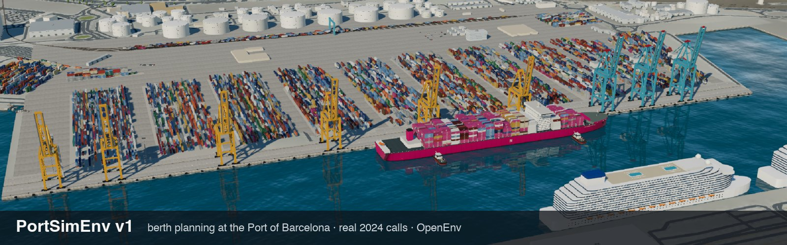

<div align="center">

<a href="https://huggingface.co/spaces/FineEnvs/PortSimEnv"></a>

<h1>PortSimEnv v1</h1>

<h3>Re-plan a broken week of container-ship dockings at the Port of Barcelona</h3>

<p>An OpenEnv environment built from the port's real 2024 records, graded deterministically against a proven optimum.</p>

<a href="https://huggingface.co/spaces/FineEnvs/PortSimEnv"></a>
<a href="https://huggingface.co/spaces/FineEnvs/PortSimEnv-Eval"></a>
<a href="https://huggingface.co/datasets/FineEnvs/PortSimEnv"></a>
<a href="https://huggingface.co/spaces/FineEnvs/simulation-rl-environments"></a>
<a href="https://github.com/huggingface/OpenEnv"></a>
<a href="https://github.com/adithya-s-k/FineEnvs/tree/main/07-simulation-environments/portsim-v1"></a>

</div>

---

## The task

The agent gets one quay at the Port of Barcelona, the ships that really called there in a 2024 week (or two, or
three), and a week that has just gone wrong: late and bunched ships, closed quay sections, crane breakdowns, gales,
emergencies, priority cargo, traffic diverted from the other terminal. It decides when, where and with how many cranes
every ship docks. The plan is graded once, deterministically, against a plan CP-SAT proved optimal.

| tool | what it does |
|---|---|
| `get_situation()` | the quay, notices, ships already alongside, closures, cranes, wind windows and the ships to berth |
| `check_plan(plan)` | rule breaks and cost of a draft plan, per ship; 10 per episode |
| `submit_plan(plan)` | ends the episode with one grade |

A plan that breaks any rule scores at most 0.2. A valid plan scores `0.2 + 0.8·e^(−gap/0.5)`, where the gap is measured
against the avoidable part of the cost, so the optimum scores 1.0. No submission scores 0. There are 1,050 training and
50 eval tasks, and no week appears in both.

## Results

Six models on the 50 eval tasks, one rollout each, 12 turns and 32k output tokens per turn. Every rollout replays in 3D
in the [eval Space](https://huggingface.co/spaces/FineEnvs/PortSimEnv-Eval).

| Model | n | Mean reward (95% CI) | standard | busy | storm | extreme | Feasible | Optimal | Ended without submit |
|---|---:|---|---:|---:|---:|---:|---:|---:|---:|
| openai:gpt-6.1-sol | 50 | **0.888** (0.833-0.940) | 0.998 | 0.900 | 0.864 | 0.822 | 100% | 52% | 0 |
| anthropic:claude-sonnet-5-5 | 50 | **0.782** (0.711-0.849) | 0.921 | 0.797 | 0.675 | 0.774 | 98% | 20% | 1 |
| hf:zai-org/GLM-5.3-Flash:baseten | 50 | **0.470** (0.357-0.588) | 0.767 | 0.500 | 0.460 | 0.240 | 50% | 18% | 14 |
| hf:Qwen/Qwen3.8-2.4T-A95B:together | 50 | **0.380** (0.271-0.493) | 0.580 | 0.449 | 0.328 | 0.215 | 46% | 10% | 16 |
| hf:zai-org/GLM-5.3:together | 50 | **0.313** (0.198-0.440) | 0.624 | 0.342 | 0.224 | 0.154 | 32% | 20% | 33 |
| hf:Qwen/Qwen3.8-27B:cerebras\|ovhcloud | 50 | **0.211** (0.115-0.318) | 0.397 | 0.274 | 0.219 | 0.003 | 26% | 6% | 34 |

GPT-6.1 Sol matches the optimum on 26 of 50 tasks, so there is plenty of headroom. The open models lose most of their
score by never calling `submit_plan`. They spend their output budget reasoning and run out of turns.

## Start here

| You want to… | Open |
|---|---|
| Play an episode in the browser | [FineEnvs/PortSimEnv](https://huggingface.co/spaces/FineEnvs/PortSimEnv) |
| Watch any eval rollout in 3D | [FineEnvs/PortSimEnv-Eval](https://huggingface.co/spaces/FineEnvs/PortSimEnv-Eval) |
| Train or evaluate on the tasks | [datasets/FineEnvs/PortSimEnv](https://huggingface.co/datasets/FineEnvs/PortSimEnv) |
| Understand the idea and the results | [Simulation RL Environments, part 1](https://huggingface.co/spaces/FineEnvs/simulation-rl-environments) |
| Read how the tasks, rules, reward and 3D view work | [DESIGN.md](DESIGN.md) |
| Read or edit the article's source | [content/articles/simulation-rl-environments](https://github.com/adithya-s-k/FineEnvs/tree/main/content/articles/simulation-rl-environments) |
| Share ideas for v2 and beyond | [GitHub discussion #36](https://github.com/adithya-s-k/FineEnvs/discussions/36) |

## Connect an agent

```python
from openenv.core.env_server.mcp_types import CallToolAction
from openenv.core.mcp_client import MCPToolClient

env = MCPToolClient("https://fineenvs-portsimenv.hf.space").sync()
obs = env.reset(task_id="dock-24B-w07x1-busy-0")       # or reset(split="train", index=0)
rules = obs.observation.metadata["instructions"]         # the system prompt
situation = env.step(CallToolAction(tool_name="get_situation", arguments={}))
plan = [{"ship": 0, "berth_hour": 0, "section": 9, "cranes": 3}]   # one entry per ship in the situation
print(env.step(CallToolAction(tool_name="check_plan", arguments={"plan": plan})).observation)
```

## Run it locally

```bash
cd envs/berth_planning/openenv
uv venv -p 3.12 && uv pip install -e '.[agents,dev]'
.venv/bin/uvicorn berth_openenv.server:app --port 8011     # then open http://127.0.0.1:8011/web
.venv/bin/python -m pytest tests -q
```

Run the eval yourself (this is how `dock-eval50` was produced):

```bash
envs/berth_planning/openenv/.venv/bin/python eval/run_eval.py --run my-run --max-tokens 32000 \
    --models anthropic:claude-sonnet-5-5 --split eval --limit 10
```

`envs/berth_planning/tools/publish_all.sh` publishes everything (bucket, dataset, environment Space, eval Space,
collection, article) and takes a step number to resume.

## Layout

```
07-simulation-environments/portsim-v1/
├── README.md, DESIGN.md     this page; how the tasks, rules, reward and 3D view work
├── assets/                  the banner
├── data/barcelona/          the 2024 container calls (CC BY-SA 4.0, see SOURCE.md)
├── envs/berth_planning/
│   ├── core/                berth_core: tasks, checker, naive + CP-SAT references, reward, prompts, pack builders
│   │                        (dock.py + build_dock.py for dock-v1; baselines.py for the lazy-policy checks)
│   ├── tasks/dock-v1-eval/  50 eval tasks (tasks.jsonl, manifest.json, build_log.jsonl)
│   ├── tasks/dock-v1-train/ 1,050 train tasks (tasks.jsonl.gz)
│   ├── tasks/berth-v1/      the first 100-task pack
│   ├── tools/               twin/ (the 3D digital twin from open data), build_dataset.py, deploy_space.py, publish_all.sh
│   └── openenv/             berth_openenv: environment, rubric, server, viewer (web/), agent harness, rollout.py
├── eval/                    run_eval.py (rollouts through the server), report.py, rescore.py
└── results/rollouts/        one directory per run: index.json, board.md, one JSON per episode
```

## Data and licence

Port of Barcelona open data, CC BY-SA 4.0 ("Contains data from the Port de Barcelona open data portal"); the task
pack is a derived database under the same licence. The 3D twin uses OpenStreetMap data (© OpenStreetMap contributors,
ODbL 1.0) and Terrain Tiles on AWS; see `web/twin/SOURCES.md`. Code is Apache-2.0 like the rest of the repository.
The idea of the viewer owes a lot to [Portwise](https://github.com/alexngdev99/rork-seaport-logistics-3d) (MIT), a
fictional Singapore terminal visualisation.
