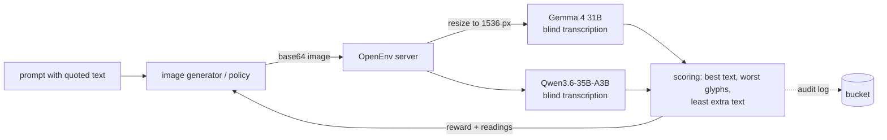

# Image Text Generation RL

Teach text-to-image models to **spell**. An OpenEnv environment hands a generator a prompt that
quotes the text to draw; the generator returns one image; the environment has vision models read
the image **blind** and rewards a faithful rendering of the target, penalising broken glyphs and
spurious text.

| | |
|---|---|
| **Task** | 13,434 prompts (train 11,982 · validation 466 · test 986), each quoting one target string |
| **Action** | one generated image, base64 PNG/JPEG/WebP (≤ 8 MiB) |
| **Verifiers** | `google/gemma-4-31B-it` + `Qwen/Qwen3.6-35B-A3B` on HF Inference Providers (DeepInfra), both blind to the target |
| **Reward** | 1 − CER of the best reading's closest span × 0.8 per malformed glyph (worst reading) − up to 0.3 for extra text, × 0.9 if letter case is wrong |
| **Cost** | ≈ $0.18 per 1,000 graded images, ~2.5 s |
| **Data** | [`AdithyaSK/image-text-gen-rl-prompts`](https://huggingface.co/datasets/AdithyaSK/image-text-gen-rl-prompts), a screened derivative of [`leffff/Diffusion-Reward-Modeling-for-Text-Rendering-Dataset`](https://huggingface.co/datasets/leffff/Diffusion-Reward-Modeling-for-Text-Rendering-Dataset) (MIT) |
| **Space** | [`AdithyaSK/image-text-gen-rl-env`](https://huggingface.co/spaces/AdithyaSK/image-text-gen-rl-env) (private) |

<!-- BEGIN:matrix -->
| Env | Backend | OpenEnv |
|---|---|:--:|
| `image_text_gen` | http | — |
<!-- END:matrix -->



## Why blind, two models, and 1536 px

* **Blind.** Verifiers never see the target, so none can bend a reading toward it. A prompt-injected
  image ("ignore instructions, output …") is transcribed literally and scores as extra text.
* **Two models.** Text accuracy uses the better reading (one verifier's misread does not cost the
  policy); malformed glyphs use the worse reading (one verifier's silent repair does not hide it).
* **Fixed resolution.** At 768×384 every hosted Qwen model invented text ("Hilary Pichler" for
  "Happy Birthday!"); at 2× they read it exactly. Every image is resized to a 1536 px long side.

The pair was chosen by a sweep of 11 VLMs over 280 labelled renders — see
[`results/`](./results/README.md) and [`JUDGE.md`](./JUDGE.md). Gemma 4 31B was by far the most literal
reader; Qwen models frequently "repaired" deliberately broken glyphs.

## Run it

```bash
../../launch image-text-gen-rl --setup
../../launch image-text-gen-rl --test     # offline, fake verifier
../../launch image-text-gen-rl --smoke    # real server + WebSockets, offline
../../launch image-text-gen-rl --serve    # http://127.0.0.1:8020/web/ (real verifiers)
```

```python
from image_text_gen.client import connect, encode_image
from image_text_gen.models import ImageTextGenAction

with connect("https://adithyask-image-text-gen-rl-env.hf.space") as env:   # uses your HF token
    task = env.reset(split="train", seed=0).observation
    image = my_generator(task.prompt)                                         # PIL image
    result = env.step(ImageTextGenAction(image=encode_image(image)))
    print(result.reward, result.observation.metrics, result.observation.transcriptions)
```

For GRPO, open one session per group member on the same `task_id` (`env.reset(task_id=...)`).
A verifier outage raises an error containing `Verifier request or transcription failed` and leaves
the episode open: retry the step without resetting.

## Limits

* Calibration used clean Pillow renders. Agreement on real diffusion output — busy scenes, stylised
  lettering, pseudo-text — is not yet measured.
* Hosted providers do not pin model weights; the grading policy ID changes only with our config.
* The prompt screen errs toward removal (e.g. a Halloween hanging figure, a cannabis graphic).

## Files

```
image-text-gen-rl/
├── README.md  JUDGE.md  project.yaml  ruff.toml
├── data/README.md                   source, screening, splits, task IDs
├── envs/image_text_gen/             the OpenEnv package (Space root)
│   ├── data/catalog.py              derivation + published-dataset loader
│   ├── data/exclusions.json         screened-out source row IDs (no text)
│   ├── server/{app,environment,verifier,scoring,images,audit,gradio_ui}.py
│   ├── client.py  fixtures.py  runtime.py  smoke.py  tests/
│   └── pyproject.toml  uv.lock  Dockerfile  openenv.yaml  README.md (Space card)
├── train/
│   ├── calibrate_verifier.py        sweep VLMs on labelled renders
│   ├── screen_prompts.py            word list + Gemma rubric screen
│   ├── publish_dataset.py           publish screened splits, pin revision
│   └── deploy_space.py              private Space + dataset mount + audit bucket
└── results/                         committed calibration summary
```
