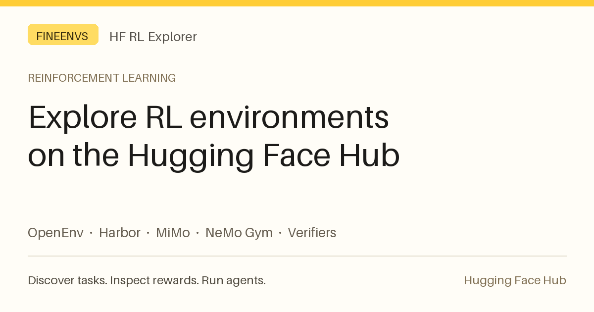

# RL environments on the Hugging Face Hub

**HF RL Explorer** helps you discover reinforcement learning environments on the Hugging Face Hub.
Explore public datasets and checked environment Spaces across OpenEnv, Harbor, MiMo, NeMo Gym and Verifiers.
Inspect individual tasks, tools and reward functions, then run supported agent rollouts and compare results.

[Open the RL environment explorer](https://fineenvs-rl-explorer.hf.space/) ·
[Explore FineEnvs environments](https://fineenvs-rl-explorer.hf.space/?owner=FineEnvs) ·
[Public task sitemap](https://fineenvs-rl-explorer.hf.space/sitemap.xml)

- **Harbor datasets**: every task folder indexed (instruction, tests, image, grader, multi-step tasks, resources);
  run one with OpenCode, Terminus 2, mini-SWE-agent or Pi on an HF Sandbox, graded by the task's own tests.
- **OpenEnv Spaces**: what a server offers, live (its tools or its reset/step actions, schemas, Task API, rewards),
  its files, a playground with rewards, its app, and MCP for coding agents. FineEnvs' curated servers come first.
- **NeMo Gym, Verifiers, verl and SkyRL datasets**: each row as its framework means it (a conversation, its tools,
  how it is scored and by what), with the exact commands to run it with that framework.
- **MiMo-V2.6 RL**: the release's tasks with its own harness, or as their Harbor conversions.
- **Graders that call a model**: the judge goes through a per-rollout relay to Inference Providers; the sandbox
  never holds a key of yours.
- **Community**: public, graded rollouts by everyone, compared by model.

Rollouts run on your Hugging Face account: the sandbox by the hour, the model's tokens on Inference Providers at the
provider's price (or an OpenAI-compatible endpoint you bring). Signing in asks for `inference-api` (the model),
`jobs` (the sandbox) and `read-repos` (your private datasets, shown only to you).

Expected answers are never shown: answer fields, `solution/` files, gold patches and the data beside a grader are
listed but withheld, on every page and over MCP.

Built by the Hugging Face FineEnvs team. Environments are read as they are on the Hub.
